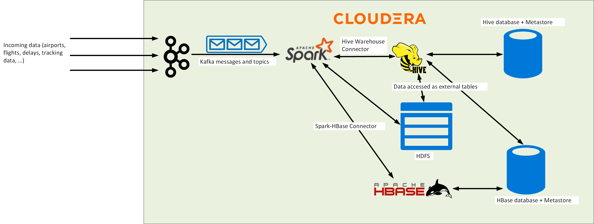
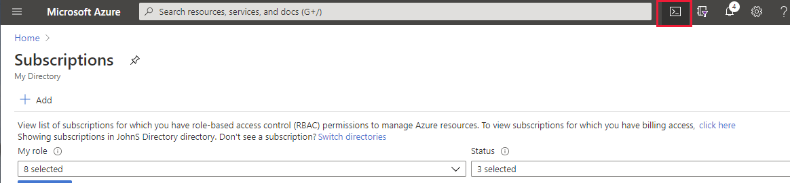
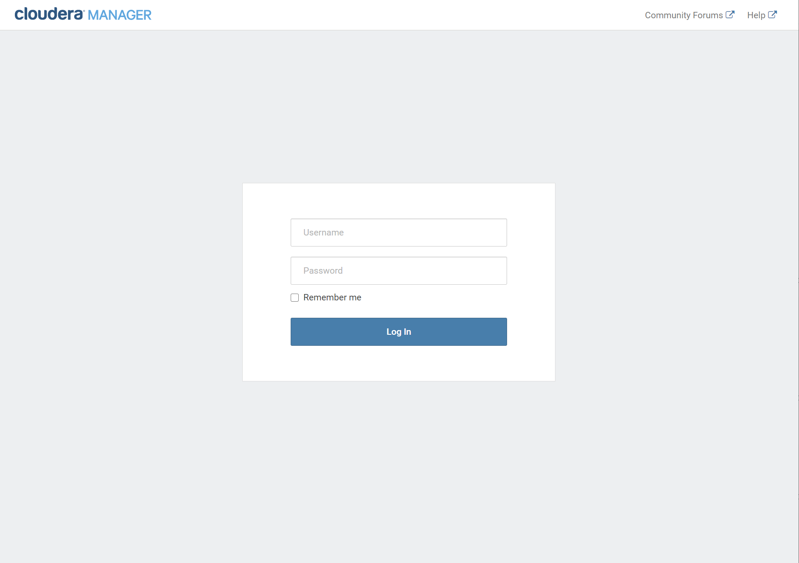
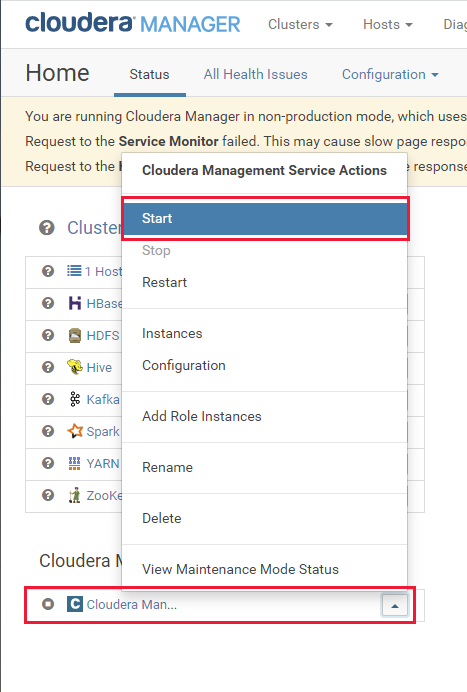
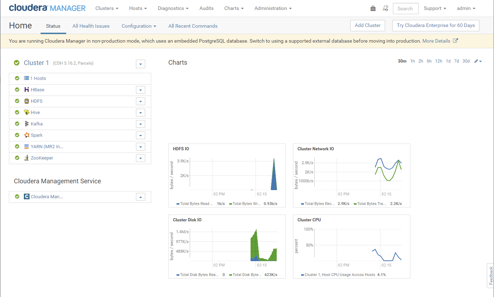

# Overview

In this workshop, you'll learn how to:

- Migrate a Kafka workload from Cloudera to an HDInsight 4.0 Kafka cluster.
- Migrate a Spark workload from Cloudera to an HDInsight 4.0 Spark cluster.
- Migrate a Hive workload and data from Cloudera to an HDInsight 4.0 LLAP cluster.
- Migrate HBase data from Cloudera to an HDInsight 4.0 HBase cluster.


This workshop follows the techniques and strategies described in the document **Migrate your Big Data Workloads to HDInsight**.

# Scenario

Imagine that you work for Contoso, an organization that performs Big Data analytics for the transport industry. The organization is currently engaged in a project that examines the data for commercial airlines, tracking which airlines fly to and from which airports, and analysing the flight times and frequency of flight delays. The data arrives from a number of sources, and includes real-time tracking information provided by the airlines and the various airports. The raw data is captured using Kafka and passed to a number of clients for processing using Spark and Hive. The processed data is stored in an HBase database for subsequent analysis. The current system is based on a Cloudera cluster, running  Hive, Spark, HBase, and Kafka services. The following image shows the high-level architecture of the existing system:



Contoso wish to move operations from Cloudera to HDInsight. However, the system cannot be shutdown while migration occurs, so the transfer must e performed in a manner that allows operations to continue during the switchover, although some temporary degradation in performance is permissible while this occurs.

You will migrate from the Cloudera cluster to four HDInsight clusters, utilizing shared cluster storage and metadata databases. This architecture enables you to decouple and tune each cluster for a specific workload, and allows you to scale the clusters independently. The solution architecture looks like this:


The HBase cluster utilizes its own storage account. The rationale behind this approach is that while Azure Data Lake Gen 2 storage gives the best performance for Hive, Spark, and Kafka clusters, HBase works best with Azure Blob storage.

**Note:** Due to time constraints, in this workshop you will not deploy the clusters using the Enterprise Security Package. In a production system, you must always ensure that your clusters run in a safe and secure environment.

# Setup

Before starting the workshop, set up the Contoso environment containing the apps and services that you will migrate to HDInsight. To save costs in this workshop, the Contoso environment consists of a single node cluster. This cluster runs Cloudera 5.16.2 and Kafka 3.1, to simulate a legacy system.

Perform the following tasks:

1. Sign in to the Azure portal using a web browser.

1. On the **Home** page, click **Subscriptions**.

    

1. Make a note of the **Subscription ID** associated with your account.

    

1. In the toolbar, click **Cloud Shell**.

    

1. In the Cloud Shell dropdown list, select **PowerShell**. Click **Confirm** if prompted.

    

1. Run the following commands to set up the parameters and configuration settings for the Contoso virtual machine and its associated resources. Replace *\<your-subscription-id\*> with the subscription ID you noted previously. You should also change the *location* variable to match your nearest Azure region.

    ```PowerShell
    #Provide the subscription Id
    $subscriptionId = '<your-subscription-id>'

    #Provide the name of your resource group
    $resourceGroupName = 'workshoprg'

    #Provide the name of the resource group holding the snapshot on which the VM is based
    $diskResourceGroupName = 'clouderarg'
    
    #Specify the location for creating resources
    $location = "East US"

    # TBD - THIS WILL HAVE TO BE STORED SOMEWHERE ACCESSIBLE TO STUDENTS
    $sourceDiskName = 'clouderadiskBeforeKafka'

    #Provide the name of the OS disk that will be created using the snapshot
    $osDiskName = 'clouderadisk'

    #Provide the name of a virtual network and subnet 
    # where virtual machine will be created
    $virtualNetworkName = 'clouderavmvnet'
    $subnetName = 'clouderasubnet'

    #VNet prefix for the VM
    $vnetprefix = '10.10.0.0'

    #Network security group name for the VNet
    $nsgName = 'clouderansg'

    #Provide the name of the virtual machine
    $virtualMachineName = 'clouderavm'

    #Provide the size of the virtual machine
    $virtualMachineSize = 'Standard_D8s_v4'
    ```
1. Create the resource group that will hold the virtual machine and resources:

    ```PowerShell
    #Set the context to the subscription Id where the resources will be created
    Select-AzSubscription -SubscriptionId $SubscriptionId

    #Create the resource group
    New-AzResourceGroup -Name $resourceGroupName -Location $location
    ```

1. Create and configure a virtual network for the virtual machine

    ```PowerShell
    #Create a virtual network for the VM
    $virtualNetwork = New-AzVirtualNetwork `
        -ResourceGroupName $resourceGroupName `
        -Location $location `
        -Name $virtualNetworkName `
        -AddressPrefix $vnetprefix/16

    #Create a network security group for the VNet 
    # and add rules to allow ports required to access Cloudera
    $nsg = New-AzNetworkSecurityGroup `
        -Name $nsgName `
        -ResourceGroupName $resourceGroupName `
        -Location $location
    
    $nsg | Add-AzNetworkSecurityRuleConfig `
        -Name 'SSHRule' `
        -Access Allow `
        -Protocol Tcp `
        -Direction Inbound `
        -Priority 100 `
        -SourceAddressPrefix Internet `
        -SourcePortRange * `
        -DestinationAddressPrefix * `
        -DestinationPortRange 22 | Set-AzNetworkSecurityGroup

    $nsg | Add-AzNetworkSecurityRuleConfig `
        -Name 'ClouderaManager' `
        -Access Allow `
        -Protocol Tcp `
        -Direction Inbound `
        -Priority 350 `
        -SourceAddressPrefix Internet `
        -SourcePortRange * `
        -DestinationAddressPrefix * `
        -DestinationPortRange 7180 | Set-AzNetworkSecurityGroup

    $nsg | Add-AzNetworkSecurityRuleConfig `
        -Name 'SCM' `
        -Access Allow `
        -Protocol Tcp `
        -Direction Inbound `
        -Priority 360 `
        -SourceAddressPrefix Internet `
        -SourcePortRange * `
        -DestinationAddressPrefix * `
        -DestinationPortRange 7182 | Set-AzNetworkSecurityGroup

    $nsg | Add-AzNetworkSecurityRuleConfig `
        -Name 'KafkaBroker' `
        -Access Allow `
        -Protocol Tcp `
        -Direction Inbound `
        -Priority 370 `
        -SourceAddressPrefix Internet `
        -SourcePortRange * `
        -DestinationAddressPrefix * `
        -DestinationPortRange 9092 | Set-AzNetworkSecurityGroup

    $nsg | Add-AzNetworkSecurityRuleConfig `
        -Name 'Zookeeper' `
        -Access Allow `
        -Protocol Tcp `
        -Direction Inbound `
        -Priority 380 `
        -SourceAddressPrefix Internet `
        -SourcePortRange * `
        -DestinationAddressPrefix * `
        -DestinationPortRange 2181 | Set-AzNetworkSecurityGroup

    $nsg | Add-AzNetworkSecurityRuleConfig `
        -Name 'Port8080' `
        -Access Allow `
        -Protocol Tcp `
        -Direction Inbound -Priority 390 -SourceAddressPrefix Internet -SourcePortRange * -DestinationAddressPrefix * -DestinationPortRange 8080 | Set-AzNetworkSecurityGroup

    #Create a subnet for the VM, and associate the NSG with the subnet
    $subnetConfig = Add-AzVirtualNetworkSubnetConfig `
        -Name $subnetName `
        -AddressPrefix $vnetprefix/24 `
        -VirtualNetwork $virtualNetwork `
        -NetworkSecurityGroup $nsg

    $virtualNetwork | Set-AzVirtualNetwork
    ```

1. Create a storage account for holding boot diagnostics for the virtual machine

    ```PowerShell
    #Create a Gen1 storage account
    $storageAccount = New-AzStorageAccount `
        -AccountName ($VirtualMachineName.ToLower()+'storage') `
        -ResourceGroupName $resourceGroupName `
        -Location $location `
        -Kind Storage `
        -SkuName Standard_GRS 
    ```

1. Create a disk containing the image for the virtual machine:

    ```PowerShell
    #Get the details of the disk containing the image for the virtual machine
    $sourceDisk = Get-AzDisk `
        -ResourceGroupName $diskResourceGroupName `
        -DiskName $sourceDiskName

    #Create a new disk for the virtual machine.
    #The disk must be big enough to hold the image
    $targetDiskConfig = New-AzDiskConfig `
        -SkuName 'Standard_LRS' `
        -osType 'Linux' `
        -UploadSizeInBytes $($sourceDisk.DiskSizeBytes+512) `
        -Location $Location `
        -CreateOption 'Upload'

    $targetDisk = New-AzDisk -ResourceGroupName $resourceGroupName `
        -DiskName $osDiskName `
        -Disk $targetDiskConfig

    #Copy the image from the source disk to the new disk
    $sourceDiskSas = Grant-AzDiskAccess -ResourceGroupName $diskResourceGroupName `
        -DiskName $sourceDiskName `
        -DurationInSecond 86400 -Access 'Read'

    $targetDiskSas = Grant-AzDiskAccess -ResourceGroupName $resourceGroupName `
        -DiskName $osDiskName `
        -DurationInSecond 86400 -Access 'Write'

    azcopy copy $sourceDiskSas.AccessSAS $targetDiskSas.AccessSAS `
        --blob-type PageBlob

    Revoke-AzDiskAccess -ResourceGroupName $diskResourceGroupName `
        -DiskName $sourceDiskName

    Revoke-AzDiskAccess -ResourceGroupName $resourceGroupName `
        -DiskName $osDiskName
   
    $disk = Get-AzDisk `
        -ResourceGroupName $resourceGroupName `
        -DiskName $osDiskName
    ```

1. Create the virtual machine using the disk and network resources your just configured:

    ```PowerShell
    #Initialize virtual machine configuration
    $VirtualMachine = New-AzVMConfig -VMName $virtualMachineName `
        -VMSize $virtualMachineSize

    #Use the Managed Disk Resource Id to attach it 
    # to the virtual machine configuration
    $VirtualMachine = Set-AzVMOSDisk `
       -VM $VirtualMachine `
        -ManagedDiskId $disk.Id `
        -CreateOption Attach -Linux

    #Create a public IP for the VM
    $publicIp = New-AzPublicIpAddress `
        -Name ($VirtualMachineName.ToLower()+'_ip') `
        -ResourceGroupName $resourceGroupName `
        -Location $location `
        -AllocationMethod Dynamic

    #Get the virtual network where virtual machine will be hosted
    $vnet = Get-AzVirtualNetwork `
        -Name $virtualNetworkName `
        -ResourceGroupName $resourceGroupName

    # Create NIC for the first subnet of the virtual network
    $nic = New-AzNetworkInterface `
        -Name ($VirtualMachineName.ToLower()+'_nic') `
        -ResourceGroupName $resourceGroupName `
        -Location $location `
        -SubnetId $vnet.Subnets[0].Id -PublicIpAddressId $publicIp.Id

    # Add the NIC to the virtual machine configuration
    $VirtualMachine = Add-AzVMNetworkInterface `
        -VM $VirtualMachine `
        -Id $nic.Id
    
    #Set the boot diagnostics storage account for the VM
    Set-AzVMBootDiagnostic `
        -VM $VirtualMachine `
        -Enable `
        -ResourceGroupName $resourceGroupName `
        -StorageAccountName $storageAccount.StorageAccountName

    #Create the virtual machine
    New-AzVM `
        -VM $VirtualMachine `
        -ResourceGroupName $resourceGroupName `
        -Location $location
    ```

1. When the virtual machine has been created, find the public IP address. Make a note of the IP address because you will need it later.

    ```PowerShell
    $ipAddr = (Get-AzPublicIpAddress `
        -Name ($VirtualMachineName.ToLower()+'_ip') `
        -ResourceGroupName $resourceGroupName).IpAddress

    echo $ipAddr
    ```

1. Connect using SSH as the **root** user. The password is **Pa55w.rdDemo**. Enter **yes** when prompted to connect.

    ```PowerShell
    ssh root@$ipAddr
    ```

1. At the *bash* prompt, run the following commands to set the password for the **azureuser** account. Provide a password of your own choosing. You'll use this account rather than root for running the Cloudera services.

    ```bash
    passwd azureuser
    ```

1. Run the following command to sign out from the virtual machine and return to the PowerShell prompt:

    ```bash
    exit
    ```

1. Connect using SSH as the **azureuser** user.

    ```PowerShell
    ssh azureuser@$ipAddr
    ```

1. At the *bash* prompt, run command shown below to set the correct hostname for the virtual machine. You may be prompted by the **sudo** command for a password; enter the password you set up for the **azureuser** account.

    ---

    **NOTE:** This step is necessary because the Cloudera installation is preconfigured with this hostname. If you leave it set at the default value generated by Azure, the Cloudera services will fail with DNS lookup errors.

    ---
    
    ```bash
    sudo hostname onprem.internal.cloudapp.net
    ```

1. Run the following commands to start the Cloudera Agent and Cloudera Server. You may be prompted by the **sudo** command for a password; enter the password you set up for the **azureuser** account.

    ```bash
    sudo service cloudera-scm-agent restart
    sudo service cloudera-scm-server restart
    ```

1. On the desktop, open a Web browser, and navigate to the URL <ip-address>:7180, where *\<ip-address\>* is the IP address of the virtual machine you noted earlier. You should see the Cloudera Manager login page.

    ---

    **NOTE:** You may need to wait for a minute or two while the Cloudera Manager is initialized.
    
    ---
    
    

1. Log in with the username **admin** with password **admin**.

1. In the Cloudera Manager, select the drop-down menu for the **Cloudera Management Service**, select **Start**, and wait for the management service to start up correctly.

    

1. Select the drop-down menu for the **Cluster 1** cluster, and wait for the various services (Zookeeper, HDFS, Kafka, HBase, Yarn, Spark, and Hive) to start.

    

1. Verify that all services are shown as running correctly.

    ---

    **NOTE:** You may receive a warning from HDFS initially, but it should clear after a minute or so.

    ---

    

1. In the Azure portal, close the PowerShell pane.


