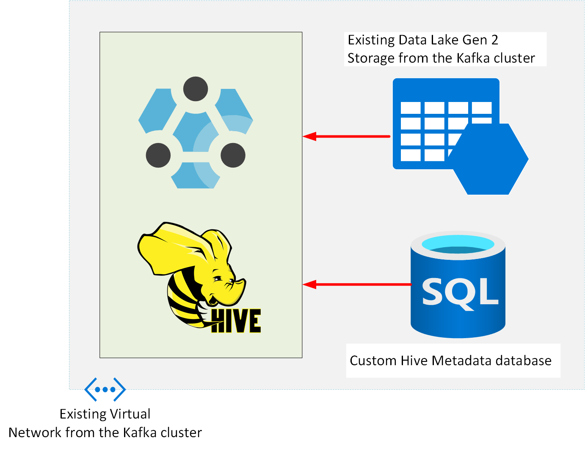
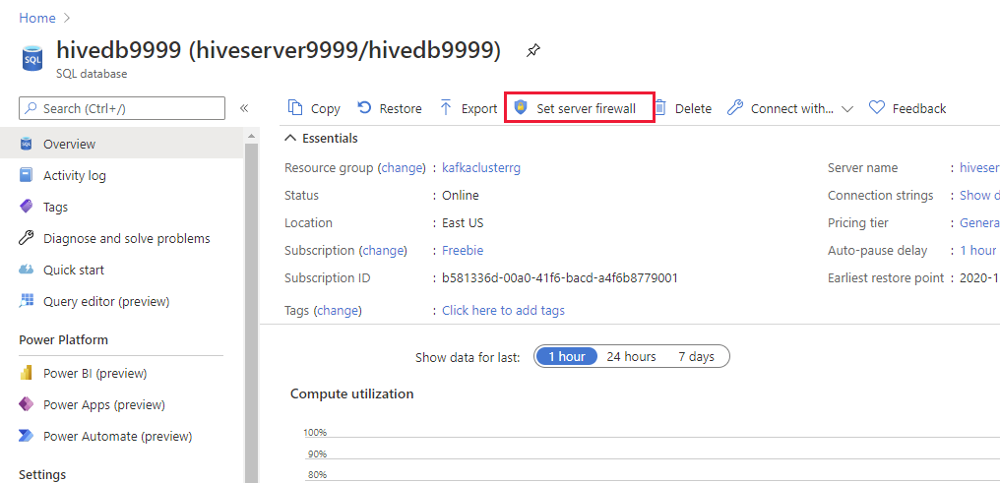
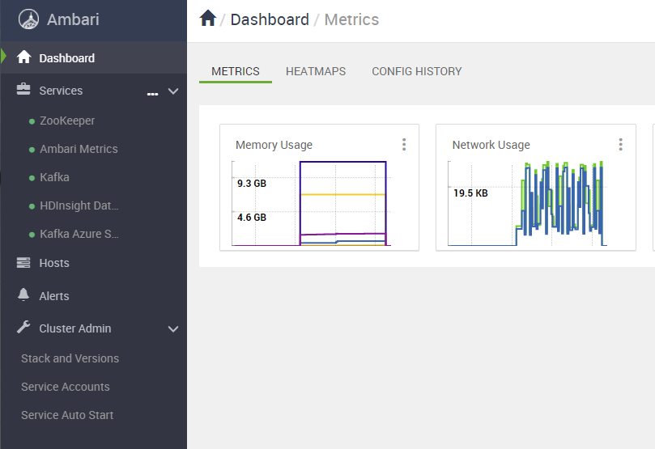

# Exercise 2: Migrate a Hive workload to HDInsight

## Introduction

In this exercise, you'll migrate an active Hive database from Cloudera to HDInsight. You'll perform the following tasks:

- Examine the workload and database currently running on Cloudera.
- Create the virtual infrastructure for an HDInsight Hive LLAP cluster, and then create the cluster.
- Use Hive export and import commands, and the DistCp utility, to transfer data from the Cloudera cluster to HDInsight.
- Verify that the data has been transferred correctly.

---

**NOTE:**

Cloudera doesn't currently support HiveServer2 replication; it implements its own replication mechanism. For this reason, you'll replicate the data in batches rather than using the continual process available through HiveServer2 replication.

---

At the end of this process, the Hive database will have been relocated to the HDInsight cluster. Applications that utilize the database for analytical purposes can be reconfigured to connect to the instance on HDInsight.

## Task 1: Run the existing workload

In the existing on-premises system, a Spark application acts as a receiver for messages arriving on a Kafka topic. The Spark application posts selected parts of this data to a Hive database for analysis. In this exercise, you'll copy the Cloudera Hive database to an HDInsight cluster.

The first task is to examine the existing system.


---

**NOTE:**
In a *fully migrated* system, the Spark application would run on an HDInsight Spark  cluster, and connect to Kafka running on an HDInsight Kafka cluster, as configured by the previous exercise. To save the costs associated with running multiple HDInsight clusters, in this exercise you'll revert to running Kafka and Spark on the original Cloudera cluster.

---

1. If you haven't already done so, on your desktop, open a **Command Prompt** window and sign in to the Cloudera virtual machine. The username is **azureuser***. Replace *\<ip_address\>* with the IP address of the virtual machine.

    ```PowerShell
    ssh azureuser@<ip address>
    ```

1. Move to the **apps/kafka** folder: 

    ```bash
    cd ~/apps/kafka
    ```

1. Start the **EventProducer** app:

    ```bash
    java -cp EventProducer.jar eventdriver \
      --bootstrap-servers onprem:9092 \
      --sourcefilename 2000.csv \
      --topic flights \
      --partitions 1 > /dev/null &
    ```

    Remember from the previous exercise that this app simulates incoming data from flights and airports (this application reads data from a CSV file rather than receiving events). This app writes messages to the **flights** topic.

1. Move to the **apps/spark** folder:

    ```bash
    cd ~/apps/spark
    ```

    This folder contains a Spark application, **SparkConsumer**, that subscribes to the **flights** topic, and writes selected information to a Hive table named **flightinfo**.

1. Start the **hive** command line tool:

    ```bash
    hive
    ```

    ---

    **NOTE:**
    You will receive warnings about the Hive CLI being deprecated, with a recommendation to use the **beeline** tool instead. However, there are issues with Beeline running on the version of Cloudera implemented on this virtual machine, so you can ignore these warnings.

    ---

1. At the **hive\>** prompt, run the following command to create the **flightinfo** table:

    ```sql
    CREATE TABLE IF NOT EXISTS flightinfo ( 
        timestamp string,
        year string,
        month string,
        dayofmonth string,
        deptime string,
        depdelay int,
        arrtime string,
        arrdelay int,
        carrier string,
        flightnum string,
        elapsedtime int,
        origin string,
        dest string,
        distance int)
    COMMENT 'Flight information'
    CLUSTERED BY (flightnum) INTO 10 BUCKETS
    ROW FORMAT DELIMITED
    FIELDS TERMINATED BY '\t'
    STORED AS ORC
    TBLPROPERTIES('transactional'='true');
    ```

1. Run the following command to quit the **hive** utility and return to the shell prompt:

    ```sql
    exit;
    ```

1. Start the **SparkConsumer** app. This command runs the app as a Spark workload:

    ```bash
    spark2-submit \
        --packages org.apache.spark:spark-sql-kafka-0-10_2.11:2.1.0 \
        --class SparkConsumer \
        --master yarn \
        --total-executor-cores 2 \
        --executor-memory 512m \
        SparkConsumer.jar \
            --application flightsapp \
            --bootstrap onprem:9092 \
            --topic flights \
            2> /dev/null
    ```

    After 10-15 seconds, you will see a couple of messages showing the schema of the incoming data, and how the app maps this data to the Hive table, followed by periodic messages displaying the data being inserted into the **flightinfo** table in the Hive database:

    ```text
    root
    |-- key: binary (nullable = true)
    |-- value: binary (nullable = true)
    |-- topic: string (nullable = true)
    |-- partition: integer (nullable = true)
    |-- offset: long (nullable = true)
    |-- timestamp: timestamp (nullable = true)
    |-- timestampType: integer (nullable = true)

    root
    |-- timestamp: string (nullable = true)
    |-- year: string (nullable = true)
    |-- month: string (nullable = true)
    |-- dayofmonth: string (nullable = true)
    |-- deptime: string (nullable = true)
    |-- depdelay: string (nullable = true)
    |-- arrtime: string (nullable = true)
    |-- arrdelay: string (nullable = true)
    |-- carrier: string (nullable = true)
    |-- flightnum: string (nullable = true)
    |-- elapsedtime: string (nullable = true)
    |-- origin: string (nullable = true)
    |-- dest: string (nullable = true)
    |-- distance: string (nullable = true)

    +-------------+------+-----+----------+-------+--------+-------+--------+-------+---------+-----------+------+-----+--------+
    |    timestamp|  year|month|dayofmonth|deptime|depdelay|arrtime|arrdelay|carrier|flightnum|elapsedtime|origin| dest|distance|
    +-------------+------+-----+----------+-------+--------+-------+--------+-------+---------+-----------+------+-----+--------+
    +-------------+------+-----+----------+-------+--------+-------+--------+-------+---------+-----------+------+-----+--------+

    +-------------+------+-----+----------+-------+--------+-------+--------+-------+---------+-----------+------+-----+--------+
    |    timestamp|  year|month|dayofmonth|deptime|depdelay|arrtime|arrdelay|carrier|flightnum|elapsedtime|origin| dest|distance|
    +-------------+------+-----+----------+-------+--------+-------+--------+-------+---------+-----------+------+-----+--------+
    |1605610024619|"2000"|  "4"|      "20"| "2008"|      43| "2124"|      33|   "DL"|    "871"|         76| "SDF"|"ATL"|     321|
    |1605610025120|"2000"| "11"|      "23"| "1034"|       4| "1201"|       1|   "DL"|    "546"|         87| "ATL"|"DAY"|     432|
    +-------------+------+-----+----------+-------+--------+-------+--------+-------+---------+-----------+------+-----+--------+

    +-------------+------+-----+----------+-------+--------+-------+--------+-------+---------+-----------+------+-----+--------+
    |    timestamp|  year|month|dayofmonth|deptime|depdelay|arrtime|arrdelay|carrier|flightnum|elapsedtime|origin| dest|distance|
    +-------------+------+-----+----------+-------+--------+-------+--------+-------+---------+-----------+------+-----+--------+
    |1605610025621|"2000"|  "5"|      "11"| "1407"|      -8| "2217"|      10|   "UA"|    "132"|        310| "KOA"|"LAX"|    2504|
    |1605610026121|"2000"| "12"|       "1"|  "758"|       3| "1323"|      -6|   "AA"|   "1584"|        205| "SFO"|"DFW"|    1464|
    |1605610026622|"2000"|  "9"|       "2"|  "922"|       7| "1014"|       4|   "DL"|    "907"|         52| "PNS"|"BTR"|     236|
    |1605610027123|"2000"|  "9"|      "21"|  "835"|       5|  "948"|      22|   "AS"|    "468"|         73| "GEG"|"SEA"|     224|
    +-------------+------+-----+----------+-------+--------+-------+--------+-------+---------+-----------+------+-----+--------+
    ...
    ```

1. Allow the the applications to run for five minutes, to generate a few hundred records.

1. Open a new command prompt window on the desktop, and open another connection to the Cloudera virtual machine.

1. At shell prompt for the second connection to the Cloudera virtual machine, start the **hive** utility:

    ```bash
    hive
    ```

1. At the **hive\>** prompt, run the following query:

    ```hive
    SELECT * FROM flightinfo;
    ```

    Verify that a number of rows appear, displaying flight information:

    ```text
    ...
    1605531142082   "2000"  "1"     "17"    "626"   0       "732"   -8      "HP"    "2431"  66      "ELP"   "PHX"   347
    1605531142583   "2000"  "1"     "22"    "624"   -2      "741"   1       "HP"    "2431"  77      "ELP"   "PHX"   347
    1605531143083   "2000"  "1"     "24"    "626"   0       "731"   -9      "HP"    "2431"  65      "ELP"   "PHX"   347
    1605531236676   "2000"  "1"     "12"    "707"   62      "836"   46      "HP"    "2763"  149     "IAH"   "PHX"   1009
    1605531237176   "2000"  "1"     "22"    "632"   27      "825"   35      "HP"    "2763"  173     "IAH"   "PHX"   1009
    1605531331272   "2000"  "1"     "27"    "953"   -2      "1206"  -1      "HP"    "2454"  73      "LAS"   "PHX"   256
    1605531331772   "2000"  "1"     "30"    "952"   -3      "1151"  -16     "HP"    "2592"  59      "LAS"   "PHX"   256
    1605531332273   "2000"  "1"     "1"     "1055"  37      "1312"  47      "HP"    "2612"  77      "LAS"   "PHX"   256
    1605531307245   "2000"  "1"     "7"     "5"     6       "217"   15      "HP"    "717"   72      "LAS"   "PHX"   256
    1605531307746   "2000"  "1"     "10"    "2358"  -1      "159"   -3      "HP"    "717"   61      "LAS"   "PHX"   256
    1605531308246   "2000"  "1"     "12"    NA      NULL    NA      NULL    "HP"    "717"   NULL    "LAS"   "PHX"   256
    1605531059483   "2000"  "1"     "21"    "657"   -3      "841"   10      "AA"    "1315"  164     "DFW"   "PHX"   868
    ...
    Time taken: 0.076 seconds, Fetched: 865 row(s)
    ```

    Make a note of the number of rows in the table (865 in the example above).

1. Wait a few seconds and repeat the query. The number of rows should have increased.

1. Quit the **hive** utility, and close the SSH connection:

    ```hive
    exit;
    ```

1. In the first SSH session connected to the Cloudera virtual machine, press CTRL-C to stop the **SparkConsumer** app, and run the following command to halt the **EventProducer** app:

    ```bash
    kill %1
    ```
   
    ---

    **NOTE:**

    In the 'live' system, the **SparkConsumer** and **EventProducer** apps will be running continually, but the Cloudera virtual machine used by this exercise provides only a limited amount of resources, and some of the subsequent procedures may take a long time to complete if these apps are left running.

    --- 

## Task 2: Create the HDInsight LLAP cluster

In this task, you'll create an HDInsight LLAP cluster for running Hive. You'll reuse the existing virtual infrastructure (storage account and network) from the Kafka cluster you created in the previous exercise. You'll create a custom Hive metadata database using Azure SQL Database. This will enable you to share the Hive metadata with other other HDInsight clusters that need to access the Hive database.



### Create the SQL database

1. On the Azure Home page, select **Create a resource**.

1. On the **New** page, in the **Search the Marketplace** box, type **SQL Database**, and then press Enter.

1. On the **SQL Database** page, select **Create**.

1. On the **Basics** tab of the **Create SQL Database** page, enter the following settings, and then select **Review + create**:

    | Field | Value|
    |-|-|
    | Subscription | Select your subscription |
    | Resource group | clusterrg |
    | Database name | hivedb*nnnn*, where *nnnn* is the same random four digit number you selected when you created the Kafka cluster (if necessary, you can use a different number, but for consistency try and reuse the same value if possible) |
    | Server | Select **Create new**. In the **New Server** pane, name the server **hiveserver*9999***, set the server admin login name to **azuresa**, provide a password of your choice, and specify the same location that you have used for other resources created during this lab. |
    | Want to use SQL elastic pool | No |
    | Compute + storage | Select **Configure database**. On the **General Purpose** tab, select **Serverless**, and then click **Apply**. |

1. On the **Create SQL Database** page, select **Create**, and wait while the database and server are created.

1. On the Azure Home page, under **Recent resources**, select **hivedb*9999***

1. On the **hivedb*9999*** page, select **Set server firewall**.

    

1. On the **Firewall settings** page, set **Allow Azure services and resources to access this server** to **Yes**, select **Save**, and then select **OK** when the firewall has been updated.

    
    
### Create the LLAP cluster

1. On the Azure Home page, select **Create a resource**.

1. On the **New** page, in the **Search the Marketplace** box, type **Azure HDInsight**, and then select **Azure HDInsight** from the list that appears.

1. On the **Azure HDInsight** page, select **Create**.

1. On the **Basics** tab of the **Create HDInsight cluster** page, enter the following settings, and then select **Next: Storage**:

    | Field | Value|
    |-|-|
    | Subscription | Select your subscription |
    | Resource group | clusterrg |
    | Cluster name | llapcluster*nnnn*, where *nnnn* is the same random four digit number you used for the SQL Database (if necessary, you can use a different number, but for consistency try and reuse the same value if possible) |
    | Region | Select the same region used by the Cloudera virtual machine and the **clusterrg** resource group |
    | Cluster type | Interactive Query |
    | Version | Interactive Query 3.1.0 (HDI 4.0) |
    | Cluster login name | admin |
    | Cluster login password | Pa55w.rdDemo |
    | Confirm cluster login password | Pa55w.rdDemo |
    | Secure Shell (SSH) username | sshuser |
    | Use cluster login password for SSH | checked |

1. On the **Storage** tab, enter the following settings, and then select **Next: Security + networking**:

    | Field | Value|
    |-|-|
    | Primary storage type | Azure Data Lake Storage Gen2 |
    | Primary storage account | Select the storage account you previously created for the Kafka cluster (**clusterstorage*9999***)|
    | Filesystem | Reuse the same container that you created for the Kafka cluster (**cluster*9999***) |
    | Identity | clustermanagedid |
    | SQL database for Ambari | leave blank |
    | SQL database for Hive | hiveserver*9999*/hivedb*9999* |
    | Authenticate SQL Database | Select **Authenticate**. On the **Authenticate** page, enter **azuresa** for the username, provide the password you created for this user in the database, and then click **Test connection**. You might receive a warning informing you that Azure couldn't currently validate the database credentials, but that you can proceed. Click **Select** to finish.
    | SQL database for Ooozie | leave blank |

1. On the **Security + networking** tab, enter the following settings, and then select **Next: Configuration + pricing**

    | Field | Value|
    |-|-|
    | Enable enterprise security package | Leave unchecked |
    | Minimum TLS version | 1.2 |
    | Virtual network | clustervnet/clusterrg |
    
    Leave all remaining settings on this tab with their default values.

1. On the **Configuration + pricing** tab, reduce the number of **Worker nodes** to 3, and change the size of the worker nodes to **D13 v2** (to save costs for this exercise). Select **Review + create**.

1. On the validation page, select **Create**, and wait while the cluster is created.

    ---

    **NOTE:** 
    
    This operation may take 15 or 20 minutes to complete

    ---

### Configure the cluster network connectivity

1. On the Home page in the Azure portal, under **Recent resources**, select **llapcluster*9999***.

1. On the **Overview** page for the cluster, under **Dashboards**, select **Ambari home**.

1. Sign in to Ambari as **admin** with password **Pa55w.rdDemo** when prompted. The Ambari page should show that the cluster is running the HDFS, Hive, and Zookeeper services (amongst others):

    

    ---

    **NOTE:**

    The YARN and MapReduce2 services will be shown as only partially available. This is because they are only active on one head node at a time. If that head node fails, they will be started on the remaining head node automatically.

    ---

1. In the left-hand pane of the Ambari page, select **Hosts**. Make a note of the name prefixes and IP addresses of the worker nodes with the prefixes prefixes **wn*X*** (**wn0**, **wn3**, and **wn4** in the example shown in the image below).

    

1. Return to the **Command Prompt** window displaying the SSH connection to the Cloudera virtual machine.

1. On the Cloudera virtual machine, run the following command to create a bash shell running as root.

    ```bash
    sudo bash
    ```

1. Edit the **/etc/hosts** file, and add entries for each of the worker nodes in the HDInsight LLAP cluster to the end of the file. The file below shows an example, based on the screenshot shown above:

    ```text
    127.0.0.1 localhost

    # The following lines are desirable for IPv6 capable hosts
    ::1 ip6-localhost ip6-loopback
    fe00::0 ip6-localnet
    ff00::0 ip6-mcastprefix
    ff02::1 ip6-allnodes
    ff02::2 ip6-allrouters
    ff02::3 ip6-allhosts

    10.10.0.4 onprem.internal.cloudapp.net onprem

    # Entries for worker nodes
    10.3.0.11 wn0-llapcl
    10.3.0.4  wn3-llapcl
    10.3.0.14 wn4-llapcl
    ```

1. Run the **ifconfig** command, and make a note of the **inet addr** field for the **eth0** device. In the example shown below, the **inet addr** is 10.10.0.4.

    ```text
    root@onprem:~/apps/spark# ifconfig
    eth0    Link encap:Ethernet  HWaddr 00:0d:3a:98:f9:70
            inet addr:10.10.0.4  Bcast:10.10.0.255  Mask:255.255.255.0
            inet6 addr: fe80::20d:3aff:fe98:f970/64 Scope:Link
            UP BROADCAST RUNNING MULTICAST  MTU:1500  Metric:1
            RX packets:45434 errors:0 dropped:15 overruns:0 frame:0
            TX packets:51027 errors:0 dropped:0 overruns:0 carrier:0
            collisions:0 txqueuelen:1000
            RX bytes:21979594 (21.9 MB)  TX bytes:11414674 (11.4 MB)

    lo      Link encap:Local Loopback
            inet addr:127.0.0.1  Mask:255.0.0.0
            ...
    ```

1. Run the following command to quit the root shell and return to the azureuser shell.

    ```bash
    exit
    ```

1. In the Azure portal, on the page for **llapcluster*9999***, under **Settings**, select **SSH + Cluster login**. In the **SSH + Cluster login** pane, in the **Hostname** list select your cluster, and then make a note of the **ssh** command you can use to connect to this cluster:

1. On the desktop, open another command prompt window, and run the SSH command you just noted, to sign in to the head node of the LLAP cluster. The password is **Pa55w.rdDemo**:

    ```bash
    ssh sshuser@llapcluster9999-ssh.azurehdinsight.net
    ```

1. Start a shell running as root:

    ```bash
    sudo bash
    ```

1. Edit the file **/etc/hosts**, and add an entry for the Cloudera virtual machine. You noted the IP address of the Cloudera virtual machine earlier. The virtual machine has the name **onprem**, with the FQDN of **onprem.internal.cloudapp.net**. The file below shows an example, using the IP address 10.10.0.4:

    ```text
    127.0.0.1 localhost

    # The following lines are desirable for IPv6 capable hosts
    ::1 ip6-localhost ip6-loopback
    fe00::0 ip6-localnet
    ff00::0 ip6-mcastprefix
    ff02::1 ip6-allnodes
    ff02::2 ip6-allrouters
    ff02::3 ip6-allhosts
    10.3.0.16 hn0-llapcl.kaetua2hhycevkq3hkawfmrwjh.bx.internal.cloudapp.net hn0-llapcl hn0-llapcl.kaetua2hhycevkq3hkawfmrwjh.bx.internal.cloudapp.net.
    ...
    # Cloudera virtual machine
    10.10.0.4 onprem.internal.cloudapp.net onprem
    ```

1. Run the following command to quit the root shell and return to the sshuser shell.

    ```bash
    exit
    ```

1. Connect to the first worker node. The password is **Pa55w.rdDemo**, as before (the example below uses **wn0-llapcl**, although the name of the first node in your cluster may be different):

    ```bash
    ssh wn0-llapcl
    ```

1. Start a shell running as root, edit the **/etc/hosts** file, add the entry for the **onprem** virtual machine as before, and then exit the root shell.

1. Disconnect from the **wn0-llapcl** node, and return to the head node of the cluster.

1. Repeat the previous three steps for the two remaining worker nodes, **wn1-llapcl** and **wn2-llapcl**.

    ---

    **NOTE:**
    Under some circumstances, the worker nodes might not be named sequentially. For example, you might find that they are named **wn2-llapcl** and **wn4-llapcl**, as illustrated in the examples shown above. Check the entries in the **/etc/hosts** file of the head node for the names of these nodes.

    ---

### Disable strict mode for managed tables in Hive

By default, the Hive LLAP server is configured to enforce *strict* mode for managed tables. This means that all tables must be transactional. Sometimes this approach can be less than optimal for read-heavy tables with few (if any) updates and deletes. The **flightinfo** table is an example of this type of table; rows are continually appended, but the data is historical and once added it doesn't change. In this task, you'll disable *strict* mode. You can still create transactional tables, but they are not enforced.

1. Switch back to Ambari for the HDInsight cluster.

1. In the left-hand pane, select **Hive**. In the main pane, on the **CONFIGS** tab, in the **filter** box, enter **strict**. 

1. Under **Advanced hive-interactive-site** and **Advanced hive-site**, change the **hive.strict.managed.tables** setting to **false**, and select **SAVE**:

    

1. In the **Confirmation** dialog box, select **SAVE**. 

1. In the **Configurations** dialog box, select **PROCEED ANYWAY**.

1. In the **Save Confirmation** dialog box, select **OK**.

1. In the **Save Configuration Changes** dialog box, select **OK**.

1. Select **RESTART**, and then select **Restart All Affected**.

1. In the **Confirmation** dialog box, select **CONFIRM RESTART ALL**, and wait for the services to restart before continuing.

## Task 3: Copy data from the Cloudera cluster to the HDInsight LLAP cluster

1.  In the Azure portal, open a Cloud Shell prompt running PowerShell.

1. Run the following command to create a directory named **staging** in the filesystem for the HDInsight cluster. Replace **\<9999\>** with the numeric suffix you used for the cluster storage account:

    ```PowerShell
    az storage fs directory create `
        --name staging `
        --file-system cluster<9999> `
        --account-name clusterstorage<9999>
    ```

1. Retrieve the storage account keys for the storage account:

    ```PowerShell
    Get-AzStorageAccountKey -ResourceGroupName 'clusterrg' `
        -AccountName 'clusterstorage<9999>'
    ```
    
    Make a note of the value of the **key1** key.

1. Return to the SSH shell on the Cloudera virtual machine.

1. Start the hive utility, and run the following query:

    ```sql
    SELECT MAX(timestamp) FROM flightinfo;
    ```

    Make a note of the value returned.

1. Create a another table named **todaysinfo** with the same structure as the **flightinfo** table:

    ```sql
    CREATE TABLE todaysinfo LIKE flightinfo;
    ```

1. Copy the data up to the point in time noted earlier to the **todaysinfo** table. Replace **\<value\>** with the value returned by the previous query:

    ```sql
    INSERT INTO todaysinfo
    SELECT * FROM flightinfo
    WHERE timestamp <= '<value>';
    ```

1. Export the **todaysinfo** table to a folder named **exports** in HDFS:

    ```sql
    export table todaysinfo to 'exports/todaysinfo';
    ```

1. Quit the hive utility:

    ```sql
    exit;
    ```

1. Run the following **DistCp** command to copy the exported data in the **exports** directory in HDFS to the **staging** directory in the HDInsight cluster. Replace **\<key\>** with the key for the storage account used by the HDInsight cluster, and replace **\<9999\>** with the numeric suffix for your storage account:

    ```bash
    hadoop distcp \
        -D fs.azure.account.key.clusterstorage<9999>.blob.core.windows.net='<key>' \
        /user/azureuser/exports/todaysinfo \
        wasbs://cluster<9999>@clusterstorage<9999>.blob.core.windows.net/staging/todaysinfo
    ```

1. Use the **hdfs** command shown below to list the contents of the **staging** directory in the storage account for the HDInsight cluster, to verify that the exported files have been transferred:

    ```bash
    hdfs dfs \
        -D fs.azure.account.key.clusterstorage<9999>.blob.core.windows.net='<key>' \
        -ls -R wasbs://cluster<9999>@clusterstorage<9999>.blob.core.windows.net/staging/todaysinfo
    ```

    The output should include the following files:

    ```text
    drwxr-xr-x   - azureuser supergroup          0 2020-11-10 14:17 wasbs://cluster<9999>@clusterstorage<9999>.blob.core.windows.net/staging/todaysinfo
    -rw-r--r--   1 azureuser supergroup       1895 2020-11-10 14:17 wasbs://cluster<9999>@clusterstorage<9999>.blob.core.windows.net/staging/todaysinfo/_metadata
    drwxr-xr-x   - azureuser supergroup          0 2020-11-10 14:17 wasbs://cluster<9999>@clusterstorage<9999>.blob.core.windows.net/staging/todaysinfo/data
    -rw-r--r--   1 azureuser supergroup      48310 2020-11-10 14:17 wasbs://cluster<9999>@clusterstorage<9999>.blob.core.windows.net/staging/todaysinfo/data/000000_0
    ```

1. Switch to the SSH session connected to the head node of the HDInsight cluster.

1. Start the **beeline** utility as the **hive** user, and connect to the local Hive server:

    ```bash
    sudo -u hive beeline -u 'jdbc:hive2://localhost:10001/;transportMode=http'
    ```

    ---

    **NOTE:**

    To import a table, you must have sufficient rights over the **/hive/warehouse/managed/** folder in the cluster filesystem. The **azureuser** account doesn't have the necessary priviliges, which is why you have started **beeline** as the **hive** user instead.

    ---

1. Create the **flightinfo** table. Make sure that you set the **transactional** table property to **false**:

    ```sql
    CREATE TABLE IF NOT EXISTS flightinfo ( 
        `timestamp` string,
        year string,
        month string,
        dayofmonth string,
        deptime string,
        depdelay int,
        arrtime string,
        arrdelay int,
        carrier string,
        flightnum string,
        elapsedtime int,
        origin string,
        dest string,
        distance int)
    COMMENT 'Flight information'
    CLUSTERED BY (flightnum) INTO 10 BUCKETS
    ROW FORMAT DELIMITED
    FIELDS TERMINATED BY '\t'
    STORED AS ORC
    TBLPROPERTIES('transactional'='false');
    ```

    ---

    **NOTE:**

    The name of the **timestamp** column is enclosed between backquote characters. This is because timestamp is a reserved word in the version of Hive implemented by the HDInsight cluster.

    ---

1. Import the data for the **flightinfo** table from the **staging** folder:

    ```sql
    import table flightinfo from '/staging/todaysinfo';
    ```

1. Disconnect from **beeline**:

    ```sql
    !quit
    ```

## Task 4: Verify that the transfer was successful

1. Restart **beeline** as the **azureuser** user:

    ```bash
    beeline -u 'jdbc:hive2://localhost:10001/;transportMode=http'
    ```

1. Run the following query to verify that the **flightinfo** table has been imported successfully:

    ```sql
    SELECT * FROM flightinfo;
    ```
    
    ---

    **You have now migrated the Hive database to HDInsight. To keep the data on the HDInsight cluster up-to-date, you can use the following general strategy:**
    
    1. Save the note of the timestamp for the last record copied from the **flightinfo** table.

    1. Using hive on the Cloudera cluster, run the following query to find the timestamp for the most recent change:

        ```sql
        SELECT MAX(`timestamp`) FROM flightinfo;
        ```
    
    1. Remove and recreate the **todaysinfo** table:

        ```sql
        DROP TABLE todaysinfo;
        CREATE TABLE todaysinfo LIKE flightinfo;
        ```

    1. Copy the latest data into the **todaysinfo** table. In this statement, **\<previous_timestamp\>** is the timestamp from the previous run, and **\<latest_timestamp\>** is the most recent timestamp:

        ```sql
        INSERT INTO todaysinfo
        SELECT * FROM flightinfo
        WHERE `timestamp` > '<previous_timestamp>' AND
              `timestamp` <= '<lastest_timestamp>';
        ```

    1. Export the **todaysinfo** table (remove any existing exported data first).

    1. Delete the existing data from the **staging** directory in the HDInsight cluster:

        ```bash
        hdfs dfs -D fs.AbstractFileSystem.wasb.Impl=org.apache.hadoop.fs.azure.Wasb \
            -D fs.azure.account.key.clusterstorage<9999>.blob.core.windows.net='<key>' \
            -rm -R wasbs://cluster<9999>@clusterstorage<9999>.blob.core.windows.net/staging
        ```

    1. Run **DistCp** to transfer the exported data to the **staging** directory.

    1. On the HDInsight cluster, import the data from the **staging** directory into the **flightinfo** table.
    
    ---

## Task 5: Tidy up

1. In the Azure portal, go to the page for the HDInsight Hive cluster.

1. In the command bar, select **Delete**.

1. In the confirmation pane, enter the name of the cluster, and then select **Delete**.