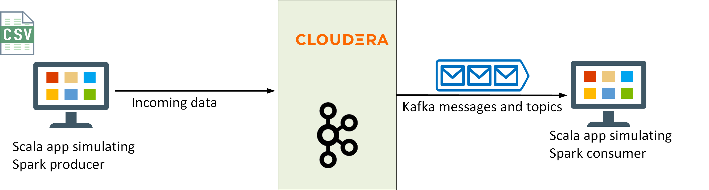
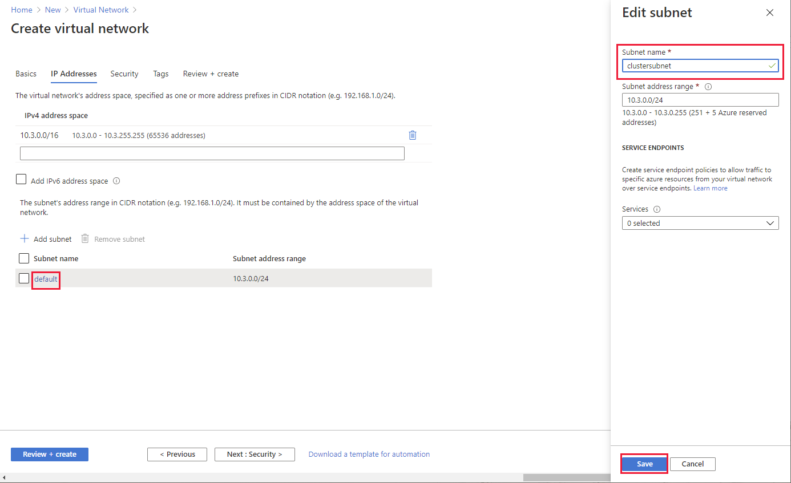
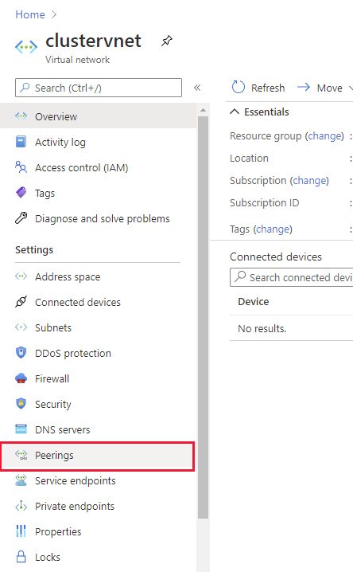
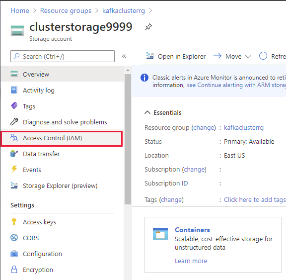

# Exercise 1 - Introduction
In this exercise, you'll migrate a Kafka workload from Cloudera to HDInsight. You'll perform the following tasks:

- Examine the existing Kafka workload running on Cloudera, including the Kafka producer and consumer applications.
- Create the virtual infrastructure for an HDInsight Kafka cluster, and then create the cluster.
- Configure MirrorMaker to replicate topics on the Cloudera cluster to the HDInsight cluster.
- Reconfigure the Kafka consumer application to receive messages from Kafka running on the HDInsight cluster.
- Reconfigure the Kafka producer application to post messages to Kafka running on the HDInsight cluster.

At the end of this process, all incoming data will be received and processed through the Kafka cluster on HDInsight, and the corresponding functionality in the Cloudera cluster can be retired.

## Task 1: Run the existing Kafka workload

The existing Kafka workload receives incoming data about airports, flights, delays, and other tracking information from a variety of sources. The Kafka producer application posts this data to Kafka topics as messages. The Kafka consumer retrieves these messages and processes them so that the data can be analyzed. 

---

**NOTE:**
In the *live* Cloudera system the consumer is a Spark application, but for the purposes of this exercise, you'll run a Scala application that simply retrieves and displays the messages from the Kafka topics. Additionally, in this exercise, the Kafka producer simulates receiving data by reading it from a CSV file.

---



1. Sign in to the Cloudera virtual machine if you haven't already done so. The username is **azureuser**, and the password is **Pa55w.rdDemo**. Replace *\<ip_address`>* with the IP address of the virtual machine.

    ```PowerShell
    ssh azureuser@$ipAddr
    ```

1. Create a new Kafka topic named **flights**. The producer capturing the flight data will post messages to this topic. This is only a single node cluster, so set the **replication-factor** to 1. Also, set the number of partitions to 1, to minimize resource utilization for this constrained environment:

    ```bash
    kafka-topics --create \
      --zookeeper onprem:2181 \
      --replication-factor 1 \
      --partitions 1 \
      --topic flights
    ```

1. Move to the **apps/kafka** folder: 

    ```bash
    cd apps/kafka
    ```

    This folder contains two applications:

    1. **Producer.jar**, that simulates incoming data from flights and airports (this application reads data from a CSV file rather than receiving events). This app writes messages to the **flights** topic.

    1. **Consumer.jar**, which subscribes to the **flights** topic and displays the contents of the messages it reads.


1. Start the Producer app:

    ```bash
    java -cp EventProducer.jar eventdriver \
      --bootstrap-servers onprem:9092 \
      --sourcefilename 2000.csv \
      --topic flights \
      --partitions 1 > /dev/null &
    ```

    This command runs the Producer app silently in the background. You will receive a warning about the log4j configuration which you can safely ignore.

1. Start the consumer app:

    ```bash
    java -cp Consumer.jar eventconsumer \
      --bootstrap-servers onprem:9092 \
      --topic flights
    ```

    You should see messages similar to the following start to appear. These are the messages posted by the Producer app:

    ```text
    Offset = 352
    Value  = {"eventData":{"timestamp":1604244845680,"dateinfo":{"year":"\"2000\"","month":"\"1\"","dayofmonth":"\"24\"","dayofweek":"\"1\"","deptime":"\"2000\"","crsdeptime":"\"2000\"","arrtime":"\"2000\"","crsarrtime":"\"2000\""},"flightinfo":{"carrier":"\"2000\"","flightnum":"\"2000\"","tailnum":"\"2000\"","elapsedtime":"\"2000\"","crselapsedtime":"\"2000\"","airtime":"\"2000\"","arrdelay":"\"2000\"","depdelay":"\"2000\"","origin":"\"2000\"","dest":"\"2000\"","distance":"\"2000\""},"delayinfo":{"taxiin":"\"2000\"","taxiout":"\"2000\"","cancelled":"\"2000\"","cancellationcode":"\"2000\"","diverted":"\"2000\"","carrierdelay":"\"2000\"","weatherdelay":"\"2000\"","nasdelay":"\"2000\"","securitydelay":"\"2000\"","lateaircraftdelay":"\"2000\""}}}
    Offset = 353
    Value  = {"eventData":{"timestamp":1604244846180,"dateinfo":{"year":"\"2000\"","month":"\"1\"","dayofmonth":"\"3\"","dayofweek":"\"1\"","deptime":"\"2000\"","crsdeptime":"\"2000\"","arrtime":"\"2000\"","crsarrtime":"\"2000\""},"flightinfo":{"carrier":"\"2000\"","flightnum":"\"2000\"","tailnum":"\"2000\"","elapsedtime":"\"2000\"","crselapsedtime":"\"2000\"","airtime":"\"2000\"","arrdelay":"\"2000\"","depdelay":"\"2000\"","origin":"\"2000\"","dest":"\"2000\"","distance":"\"2000\""},"delayinfo":{"taxiin":"\"2000\"","taxiout":"\"2000\"","cancelled":"\"2000\"","cancellationcode":"\"2000\"","diverted":"\"2000\"","carrierdelay":"\"2000\"","weatherdelay":"\"2000\"","nasdelay":"\"2000\"","securitydelay":"\"2000\"","lateaircraftdelay":"\"2000\""}}}
    Offset = 354
    Value  = {"eventData":{"timestamp":1604244846681,"dateinfo":{"year":"\"2000\"","month":"\"1\"","dayofmonth":"\"5\"","dayofweek":"\"3\"","deptime":"\"2000\"","crsdeptime":"\"2000\"","arrtime":"\"2000\"","crsarrtime":"\"2000\""},"flightinfo":{"carrier":"\"2000\"","flightnum":"\"2000\"","tailnum":"\"2000\"","elapsedtime":"\"2000\"","crselapsedtime":"\"2000\"","airtime":"\"2000\"","arrdelay":"\"2000\"","depdelay":"\"2000\"","origin":"\"2000\"","dest":"\"2000\"","distance":"\"2000\""},"delayinfo":{"taxiin":"\"2000\"","taxiout":"\"2000\"","cancelled":"\"2000\"","cancellationcode":"\"2000\"","diverted":"\"2000\"","carrierdelay":"\"2000\"","weatherdelay":"\"2000\"","nasdelay":"\"2000\"","securitydelay":"\"2000\"","lateaircraftdelay":"\"2000\""}}}
    ...
    ```

1. Press Ctrl-C to stop the Consumer app.

1. Type the following command to terminate the Producer app:

    ```bash
    kill %1
    ```

## Task 2: Create the HDInsight Kafka cluster

In this task, you'll create a new virtual network and subnet to host the cluster. You'll peer this network with the network used by the Cloudera virtual machine. Then you'll create an Azure Data Lake Gen 2 storage account to be used as the cluster storage for the HDInsight Kafka cluster. Next, you'll add a user-assigned managed identity that HDInsight will use to access the cluster storage. Finally, you'll create the Kafka cluster using this virtual infrastructure.


### Create the virtual network

1. Return to the Azure portal in the web browser.

1. On the Home page, hover over the **Resource Groups** icon, and then select **Create**:

    

1. On the **Create a resource group** page,  select the same subscription and region that you used to create the Cloudera virtual machine. Name the resource group **kafkaclusterrg**, and then select **Review + create**.

1. On the validation page, select **Create**, and wait while the resource group is created.

1. On the Azure Home page, select **Create a resource**.

1. On the **New** page, in the **Search the Marketplace** box, type **virtual network**, and then select **Virtual Network** from the list that appears:

    

1. On the **Virtual Network** page, select **Create**

1. On the **Basics** tab of the **Create virtual network** page, enter the following settings, and then select **Next: IP Addresses**:

    | Field | Value|
    |-|-|
    | Subscription | Select your subscription |
    | Resource group | kafkaclusterrg |
    | Name | clustervnet |
    | Region | Select the same region used by the Cloudera virtual machine and the **kafkaclusterrg** resource group |


1. On the **IP Addresses** tab, enter the following settings, and then select **Review + create**:

    | Field | Value|
    |-|-|
    | IPv4 address space | Accept the default address space |
    | Add IPv6 address space | Leave unchecked |
    | Add subnet | Click the **default** subnet. In the **Edit subnet** pane, change the name of the subnet to **clustersubnet**, and then select **Save** |

    

1. On the validation page, select **Create**, and wait while the virtual network is created.

1. On the Home page in the Azure portal, under **Recent resources**, select **clustervnet**:

    

1. On the **clustervnet** page, under **Settings**, select **Peerings**:

    

1. On the **clustervnet | Peerings** page, select **Add**:

    

1. On the **Add peering** page, enter the following settings, and then select **OK**:

    | Field | Value|
    |-|-|
    | Name of the peering from clustervnet to remote virtual network | clustervnet-to-clouderavnet |
    | Virtual network deployment model | Resource manager |
    | I know my resource ID | Leave unchecked |
    | Subscription | Select your subscription |
    | Virtual network | clouderavmvnet-vnet (workshoprg) |
    | Name of the peering from clouderarg-vnet to clustervnet | clouderavnet-to-clustervnet |
    | Allow virtual network access from clustervnet to clouderarg-vnet | Enabled |
    | Allow virtual network access from clouderarg-vnet to clustervnet | Enabled
    | Allow forwarded traffic from clouderarg-vnet to clustervn | Disabled |
    | Allow forwarded traffic from clustervnet to clouderarg-vnet | Disabled |
    | Allow gateway transit | Leave unchecked |

1. Wait while the network peerings are created.

### Create the storage account

1. On the Azure Home page, select **Create a resource**.

1. On the **New** page, in the **Search the Marketplace** box, type **virtual network**, and then select **Storage account** from the list that appears.

1. On the **Storage account** page, select **Create**.

1. On the **Basics** tab of the **Create storage account** page, enter the following settings, and then select **Next: Networking**:

    | Field | Value|
    |-|-|
    | Subscription | Select your subscription |
    | Resource group | kafkaclusterrg |
    | Storage account name | clusterstorage*nnnn*, where *nnnn* is a random four digit number you select to avoid clashing with other storage accounts |
    | Location | Select the same region used by the Cloudera virtual machine and the **kafkaclusterrg** resource group |
    | Performance | Standard |
    | Account Kind | StorageV2 (general purpose v2) |
    | Replication | |one-redundant storage (ZRS) |

1. On the **Networking** tab, accept the default settings, and then select **Next: Data protection**.

1. On the **Data protection** tab, accept the default settings, and then select **Next: Advanced**.

1. On **Advanced** tab, under **Data Lake Storage Gen2**, select **Enabled** for **Hierarchical namespace**. Leave all other settings at their default values, and then select **Review + create**

1. On the validation page, select **Create**, and wait while the storage account is created.

### Create the user assigned managed identity

1. On the Azure Home page, select **Create a resource**.

1. On the **New** page, in the **Search the Marketplace** box, type **user assigned**, and then select **User Assigned Managed Identity** from the list that appears.

1. On the **User Assigned Managed Identity** page, select **Create**.

1. On the **Basics** tab of the **Create User Assigned Managed Identity** page, enter the following settings, and then select **Next: Networking**:

    | Field | Value|
    |-|-|
    | Subscription | Select your subscription |
    | Resource group | kafkaclusterrg |
    | Region | Select the same region used by the Cloudera virtual machine and the **kafkaclusterrg** resource group |
    | Name | clustermanagedid |

1. On the validation page, select **Create**, and wait while the user assigned managed identity is created.

1. On the Home page in the Azure portal, under Recent resources, select **clusterstorage*9999***.

1. On the **clusterstorage*9999*** page select **Access Control (IAM)**:

    

1. On the **clusterstorage*9999* | Access Control (IAM)** page select **Add**, and then select **Add role assignment**:


    

1. In the **Add role assignment** pane, enter the following settings, and then select **Save**:

    | Field | Value|
    |-|-|
    | Role | Storage Blob Data Ower |
    | Assign access to | User assigned managed identity |
    | Subscription | Select your subscription |
    | Select | clustermanagedid |

1. Wait while the role is assigned, and the click **Role assignments* to verify that it has been assigned successfully:

    

### Create the Kafka cluster

START HERE

## Task 3: Configure MirrorMaker to replicate topics

In this task, you'll configure peering between the virtual network containing the Cloudera cluster and the virtual network for the HDInsight Kafka cluster. You'll then use MirrorMaker to replicate Kafka topics from the Cloudera cluster to the HDInsight cluster:


1. STEP 1
2. STEP 2

## Task 4: Reconfigure the Kafka consumer application

In this task, you'll reconfigure the Kafka consumer application to subscribe to topics in the HDInsight Kafka cluster.


1. STEP 1
2. STEP 2

## Task 5: Reconfigure the Kafka producer application

In this task, you'll update the producer application to post messages to topics in the HDInsight cluster. After this step is complete, you can decommission Kafka in the Cloudera cluster.


1. STEP 1
2. STEP 2
