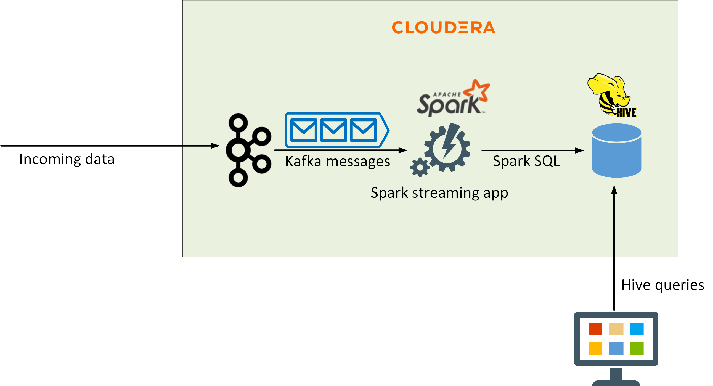
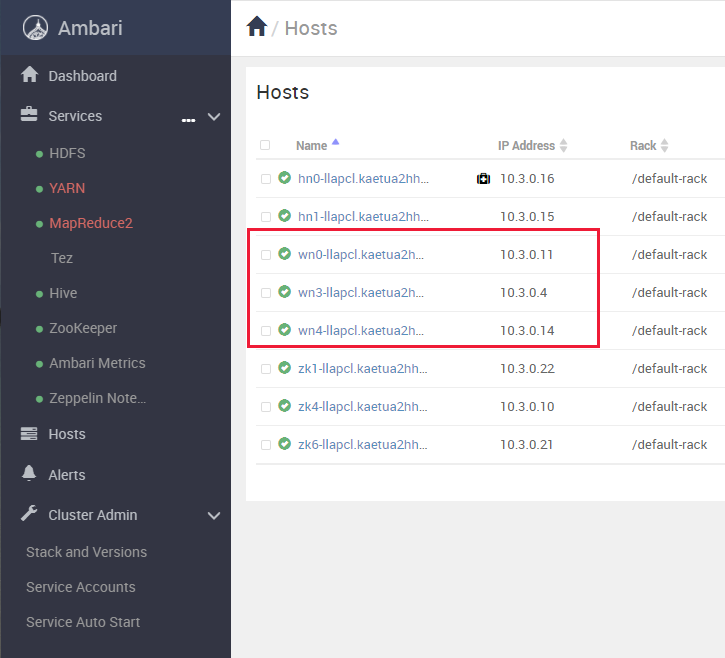

# Exercise 2: Migrate a Hive workload to HDInsight

## Introduction

In this exercise, you'll migrate an active Hive database from Cloudera to HDInsight. You'll perform the following tasks:

- Examine the workload and database currently running on Cloudera.
- Create the virtual infrastructure for an HDInsight Hive LLAP cluster, and then create the cluster.
- Configure Hive replication to transfer the Hive database from Cloudera to the HDInsight cluster.
- Verify that the data is being replicated correctly.

At the end of this process, the Hive database will have been relocated to the HDInsight cluster. Any applications that utilize the database can be reconfigured to connect to the instance on HDInsight.

## Task 1: Run the existing workload

In the existing on-premises system, a Spark application acts as a receiver for messages arriving on a Kafka topic. The Spark application posts selected parts of this data to a Hive database for analysis. In this exercise, you'll replicate the Cloudera Hive database to an HDInsight cluster while the Spark application is running. 

The first task is to examine the existing system



---

**NOTE:**
In a *fully migrated* system, the Spark application would run on an HDInsight Spark  cluster, and connect to Kafka running on an HDInsight Kafka cluster, as configured by the previous exercise. To save the costs of running multiple HDInsight clusters, in this exercise you'll revert to running Kafka on the original Cloudera cluster.

---

1. On your desktop, open a **Command Prompt** window and sign in to the Cloudera virtual machine. The username is **azureuser***. Replace *\<ip_address`>* with the IP address of the virtual machine.

    ```PowerShell
    ssh azureuser@<ip address>
    ```

1. Move to the **apps/kafka** folder: 

    ```bash
    cd ~/apps/kafka
    ```

1. Start the Producer app:

    ```bash
    java -cp EventProducer.jar eventdriver \
      --bootstrap-servers onprem:9092 \
      --sourcefilename 2000.csv \
      --topic flights \
      --partitions 1 > /dev/null &
    ```

    Remember from the previous exercise that this app simulates incoming data from flights and airports (this application reads data from a CSV file rather than receiving events). This app writes messages to the **flights** topic.

1. Move to the **apps/spark** folder:

    ```bash
    cd ~/apps/spark
    ```

    This folder contains a Spark application, **SparkConsumer**, that subscribes to the **flights** topic, and writes selected information to a Hive table named **flightinfo**.

1. Start the **hive** command line tool:

    ```bash
    hive
    ```

    ---

    **NOTE:**
    You will receive warnings about the Hive CLI being deprecated, with a recommendation to use the **beeline** tool instead. However, there are issues with Beeline running on the version of Cloudera implemented on this virtual machine, so you can ignore these warnings.

    ---

1. At the **hive\>** prompt, run the following command to create the **flightinfo** table:

    ```sql
    CREATE TABLE IF NOT EXISTS flightinfo ( 
        timestamp string,
        year string,
        month string,
        dayofmonth string,
        deptime string,
        arrtime string,
        carrier string,
        flightnum string,
        elapsedtime int,
        origin string,
        dest string,
        distance int)
    COMMENT 'Flight information'
    CLUSTERED BY (flightnum) INTO 10 BUCKETS
    ROW FORMAT DELIMITED
    FIELDS TERMINATED BY '\t'
    STORED AS ORC
    TBLPROPERTIES('transactional'='true');
    ```

1. Run the following command to quit the **hive** utility and return to the shell prompt:

    ```sql
    exit;
    ```

1. Start the **SparkConsumer** app. This command runs the app as a Spark workload:

    ```bash
    spark2-submit \
        --packages org.apache.spark:spark-sql-kafka-0-10_2.11:2.1.0 \
        --class SparkConsumer \
        --master yarn \
        --total-executor-cores 2 \
        --executor-memory 512m \
        SparkConsumer.jar \
            --application flightsapp \
            --bootstrap onprem:9092 \
            --topic flights \
            2> /dev/null
    ```

    After 10-15 seconds, you will see a couple of messages showing the schema of the incoming data, and how the app maps this data to the Hive table, followed by periodic messages displaying the data being inserted into the **flightinfo** table in the Hive database:

    ```text
    root
    |-- key: binary (nullable = true)
    |-- value: binary (nullable = true)
    |-- topic: string (nullable = true)
    |-- partition: integer (nullable = true)
    |-- offset: long (nullable = true)
    |-- timestamp: timestamp (nullable = true)
    |-- timestampType: integer (nullable = true)

    root
    |-- timestamp: string (nullable = true)
    |-- year: string (nullable = true)
    |-- month: string (nullable = true)
    |-- dayofmonth: string (nullable = true)
    |-- deptime: string (nullable = true)
    |-- arrtime: string (nullable = true)
    |-- carrier: string (nullable = true)
    |-- flightnum: string (nullable = true)
    |-- elapsedtime: string (nullable = true)
    |-- origin: string (nullable = true)
    |-- dest: string (nullable = true)
    |-- distance: string (nullable = true)

    +---------+----+-----+----------+-------+-------+-------+---------+-----------+------+----+--------+
    |timestamp|year|month|dayofmonth|deptime|arrtime|carrier|flightnum|elapsedtime|origin|dest|distance|
    +---------+----+-----+----------+-------+-------+-------+---------+-----------+------+----+--------+
    +---------+----+-----+----------+-------+-------+-------+---------+-----------+------+----+--------+

    +-------------+------+-----+----------+-------+-------+-------+---------+-----------+------+-----+--------+
    |    timestamp|  year|month|dayofmonth|deptime|arrtime|carrier|flightnum|elapsedtime|origin| dest|distance|
    +-------------+------+-----+----------+-------+-------+-------+---------+-----------+------+-----+--------+
    |1604919325669|"2000"|  "1"|      "19"| "1022"| "1151"|   "DL"|   "1295"|        149| "DFW"|"PHX"|     868|
    |1604919326170|"2000"|  "1"|      "22"| "1029"| "1207"|   "DL"|   "1295"|        158| "DFW"|"PHX"|     868|
    |1604919326670|"2000"|  "1"|      "23"| "1017"| "1156"|   "DL"|   "1295"|        159| "DFW"|"PHX"|     868|
    |1604919327171|"2000"|  "1"|      "29"| "1024"| "1206"|   "DL"|   "1295"|        162| "DFW"|"PHX"|     868|
    +-------------+------+-----+----------+-------+-------+-------+---------+-----------+------+-----+--------+

    +-------------+------+-----+----------+-------+-------+-------+---------+-----------+------+-----+--------+
    |    timestamp|  year|month|dayofmonth|deptime|arrtime|carrier|flightnum|elapsedtime|origin| dest|distance|
    +-------------+------+-----+----------+-------+-------+-------+---------+-----------+------+-----+--------+
    |1604919334682|"2000"|  "1"|      "10"|     NA|     NA|   "HP"|   "2289"|         NA| "DFW"|"PHX"|     868|
    |1604919335183|"2000"|  "1"|      "13"| "1203"| "1331"|   "HP"|   "2289"|        148| "DFW"|"PHX"|     868|
    |1604919335683|"2000"|  "1"|      "15"| "1202"| "1329"|   "HP"|   "2289"|        147| "DFW"|"PHX"|     868|
    +-------------+------+-----+----------+-------+-------+-------+---------+-----------+------+-----+--------+
    ...
    ```

1. Leave the SparkConsumer app running, and open a new command prompt window on the desktop. Open another connection to the Cloudera virtual machine:

    ```bash
    ssh azureuser@<ip address>
    ```

1. In the new connection, start the **hive** utility:

    ```bash
    hive
    ```

1. At the **hive\>** prompt, run the following query:

    ```hive
    SELECT * FROM flightinfo;
    ```

    Verify that a number of rows appear, displaying flight information:

    ```text
    ...
    1604920118839   "2000"  "1"     "15"    "1116"  "1354"  "HP"    "2513"  98      "RNO"   "PHX"   601
    1604920940380   "2000"  "1"     "11"    "920"   "1130"  "WN"    "1339"  70      "BUR"   "PHX"   369 
    1604920953896   "2000"  "1"     "24"    NA      NA      "HP"    "2807"  NULL    "BWI"   "PHX"   1999
    1604920967913   "2000"  "1"     "11"    "732"   "955"   "CO"    "1547"  263     "CLE"   "PHX"   1737
    1604919954727   "2000"  "1"     "23"    "755"   "948"   "WN"    "456"   53      "ONT"   "PHX"   325
    1604919955227   "2000"  "1"     "25"    "814"   "1009"  "WN"    "456"   55      "ONT"   "PHX"   325
    1604920024278   "2000"  "1"     "17"    "1043"  "1331"  "HP"    "777"   228     "ORD"   "PHX"   1440
    1604920024778   "2000"  "1"     "24"    "1045"  "1325"  "HP"    "777"   220     "ORD"   "PHX"   1440
    Time taken: 0.076 seconds, Fetched: 865 row(s)
    ```

    Make a note of the number of rows in the table (865 in the example above).

1. Wait a few seconds and repeat the query. The number of rows should have increased.

1. Quit the **hive** utility, but leave the SSH connection open:

    ```hive
    exit;
    ```

## Task 2: Create the HDInsight LLAP cluster

In this task, you'll create an HDInsight LLAP cluster for running Hive. You'll reuse the existing virtual infrastructure (storage account and network) from the Kafka cluster you created in the previous exercise. You'll create a custom Hive metadata database using Azure SQL Database. This will enable you to share the Hive metadata with other other HDInsight clusters that need to access the Hive database.


### Create the SQL database

1. On the Azure Home page, select **Create a resource**.

1. On the **New** page, in the **Search the Marketplace** box, type **SQL Database HDInsight**, and then press Enter.

1. On the **SQL Database** page, select **Create**.

1. On the **Basics** tab of the **Create SQL Database** page, enter the following settings, and then select **Review + create**:

    | Field | Value|
    |-|-|
    | Subscription | Select your subscription |
    | Resource group | clusterrg |
    | Database name | hivedb*nnnn*, where *nnnn* is the same random four digit number you selected when you created the Kafka cluster (if necessary, you can use a different number, but for consistency try and reuse the same value if possible) |
    | Server | Select **Create new**. In the **New Server** pane, name the server **hiveserver*9999***, set the server admin login name to **azuresa**, provide a password of your choice, and specify the same location that you have used for other resources created during this lab. |
    | Want to use SQL elastic pool | No |
    | Compute + storage | Select **Configure database**. On the **General Purpose** tab, select **Serverless**, and then click **Apply**. |

1. On the **Create SQL Database** page, select **Create**, and wait while the database and server are created.

1. On the Azure Home page, under **Recent resources**, select **hivedb*9999***

1. On the **hivedb*9999*** page, select **Set server firewall**.

    

1. On the **Firewall settings** page, set **Allow Azure services and resources to access this server** to **Yes**, select **Save**, and then select **OK** when the firewall has been updated.

    
    
### Create the cluster

1. On the Azure Home page, select **Create a resource**.

1. On the **New** page, in the **Search the Marketplace** box, type **Azure HDInsight**, and then select **Azure HDInsight** from the list that appears.

1. On the **Azure HDInsight** page, select **Create**.

1. On the **Basics** tab of the **Create HDInsight cluster** page, enter the following settings, and then select **Next: Storage**:

    | Field | Value|
    |-|-|
    | Subscription | Select your subscription |
    | Resource group | clusterrg |
    | Cluster name | llapcluster*nnnn*, where *nnnn* is the same random four digit number you used for the SQL Database (if necessary, you can use a different number, but for consistency try and reuse the same value if possible) |
    | Region | Select the same region used by the Cloudera virtual machine and the **clusterrg** resource group |
    | Cluster type | Interactive Query |
    | Version | Interactive Query 3.1.0 (HDI 4.0) |
    | Cluster login name | admin |
    | Cluster login password | Pa55w.rdDemo |
    | Confirm cluster login password | Pa55w.rdDemo |
    | Secure Shell (SSH) username | sshuser |
    | Use cluster login password for SSH | checked |

1. On the **Storage** tab, enter the following settings, and then select **Next: Security + networking**:

    | Field | Value|
    |-|-|
    | Primary storage type | Azure Data Lake Storage Gen2 |
    | Primary storage account | Select the storage account you previously created for the Kafka cluster (**clusterstorage*9999***)|
    | Container | Reuse the same container that you created for the Kafka cluster (**cluster*9999***) |
    | SQL database for Ambari | leave blank |
    | SQL database for Hive | hiveserver*9999*/hivedb*9999* |
    | Authenticate SQL Database | Select **Authenticate**. On the **Authenticate** page, enter **azuresa** for the username, provide the password you created for this user in the database, and then click **Test Connection**. You should receive a warning informing you that Azure couldn't currently validate the database credentials, but that you can proceed (if you provided invalid credentials, you'll see an error message rather than a warning). Click **Select** to finish.
    | SQL database for Ooozie | leave blank |

1. On the **Security + networking** tab, enter the following settings, and then select **Next: Configuration + pricing**

    | Field | Value|
    |-|-|
    | Enable enterprise security package | Leave unchecked |
    | Minimum TLS version | 1.2 |
    | Virtual network | clustervnet/clusterrg |
    
    Leave all remaining settings on this tab with their default values.

1. On the **Configuration + pricing** tab, reduce the number of **Worker nodes** to 3, and change the size of the worker nodes to **D13 v2** (to save costs for this exercise). Select **Review + create**.

1. On the validation page, select **Create**, and wait while the cluster is created.

    ---

    **NOTE:** This operation may take 15 or 20 minutes to complete

    ---

### Configure the cluster network connectivity

1. On the Home page in the Azure portal, under **Recent resources**, select **llapcluster*9999***.

1. On the **Overview** page for the cluster, under **Dashboards**, select **Ambari home**.

1. Sign in to Ambari as **admin** with password **Pa55w.rdDemo** when prompted. The Ambari page should show that the cluster is running the HDFS, Hive, and Zookeeper services (amongst others).:

    

    ---

    **NOTE:**

    The YARN and MapReduce2 services will be shown as only partially available. This is because they are only active on one head node at a time. If that head node fails, they will be started on the remaining head node automatically.

    ---

1. In the left-hand pane of the Ambari page, select **Hosts**. Make a note of the name prefixes and IP addresses of the worker nodes with the prefixes **wn0**, **wn1**, and **wn2**.

    

1. Return to the **Command Prompt** window displaying the inactive SSH connection to the Cloudera virtual machine (the other SSH connection should still be running the Spark application that writes data to Hive).

1. Run the following command to create a bash shell running as root.

    ```bash
    sudo bash
    ```

1. Edit the **/etc/hosts** file, and add entries for each of the worker nodes in the HDInsight Kafka cluster to the end of the file. The file below shows an example, based on the screenshot shown above:

    ```text
    127.0.0.1 localhost

    # The following lines are desirable for IPv6 capable hosts
    ::1 ip6-localhost ip6-loopback
    fe00::0 ip6-localnet
    ff00::0 ip6-mcastprefix
    ff02::1 ip6-allnodes
    ff02::2 ip6-allrouters
    ff02::3 ip6-allhosts

    # Entries for worker nodes
    10.3.0.11 wn0-llapcl
    10.3.0.4  wn3-llapcl
    10.3.0.14 wn4-llapcl
    ```

1. Run the **ifconfig** command, and make a note of the **inet addr** field for the **eth0** device. In the example shown below, the **inet addr** is 10.10.0.4.

    ```text
    root@onprem:~/apps/kafka# ifconfig
    eth0    Link encap:Ethernet  HWaddr 00:0d:3a:98:f9:70
            inet addr:10.10.0.4  Bcast:10.10.0.255  Mask:255.255.255.0
            inet6 addr: fe80::20d:3aff:fe98:f970/64 Scope:Link
            UP BROADCAST RUNNING MULTICAST  MTU:1500  Metric:1
            RX packets:45434 errors:0 dropped:15 overruns:0 frame:0
            TX packets:51027 errors:0 dropped:0 overruns:0 carrier:0
            collisions:0 txqueuelen:1000
            RX bytes:21979594 (21.9 MB)  TX bytes:11414674 (11.4 MB)

    lo      Link encap:Local Loopback
            inet addr:127.0.0.1  Mask:255.0.0.0
            ...
    ```

1. Run the following command to quit the root shell and return to the azureuser shell.

    ```bash
    exit
    ```

1. In the Azure portal, on the page for **llapcluster*9999***, under **Settings**, select **SSH + Cluster login**. In the **SSH + Cluster login** pane, in the **Hostname** list select your cluster, and then make a note of the **ssh** command you can use to connect to this cluster:

1. On the desktop, open another command prompt window, and run the SSH command you just noted, to sign in to the head node of the Kafka cluster. The password is **Pa55w.rdDemo**:

    ```bash
    ssh sshuser@llapcluster9999-ssh.azurehdinsight.net
    ```

1. Start a shell running as root:

    ```bash
    sudo bash
    ```
1. Edit the file **/etc/hosts**, and add an entry for the Cloudera virtual machine. You noted the IP address of the Cloudera virtual machine earlier. The virtual machine has the name **onprem**, with the FQDN of **onprem.internal.cloudapp.net**. The file below shows an example, using the IP address 10.10.0.4:

    ```text
    127.0.0.1 localhost

    # The following lines are desirable for IPv6 capable hosts
    ::1 ip6-localhost ip6-loopback
    fe00::0 ip6-localnet
    ff00::0 ip6-mcastprefix
    ff02::1 ip6-allnodes
    ff02::2 ip6-allrouters
    ff02::3 ip6-allhosts
    10.3.0.16 hn0-llapcl.kaetua2hhycevkq3hkawfmrwjh.bx.internal.cloudapp.net hn0-llapcl hn0-llapcl.kaetua2hhycevkq3hkawfmrwjh.bx.internal.cloudapp.net.
    ...
    # Cloudera virtual machine
    10.10.0.4 onprem.internal.cloudapp.net onprem
    ```

1. Run the following command to quit the root shell and return to the sshuser shell.

    ```bash
    exit
    ```

1. Connect to the first worker node. The password is **Pa55w.rdDemo**, as before:

    ```bash
    ssh wn0-llapcl
    ```

1. Start a shell running as root, edit the **/etc/hosts** file, add the entry for the **onprem** virtual machine as before, and then exit the root shell.

1. Disconnect from the wn0-kafkac node, and return to the head node of the cluster.

1. Repeat the previous three steps for the two remaining worker nodes, **wn1-llapcl** and **wn2-llapcl**.


    ---

    **NOTE:**
    Under some circumstances, the worker nodes might not be named sequentially. For example, you might that they are named **wn3-llapcl** and **wn4-llapcl**, as illustrated in the examples shown above. Check the entries in the **/etc/hosts** file of the head node for the names of these nodes.

    ---

### Replicate data from the Cloudera cluster to the HDInsight LLAP cluster
