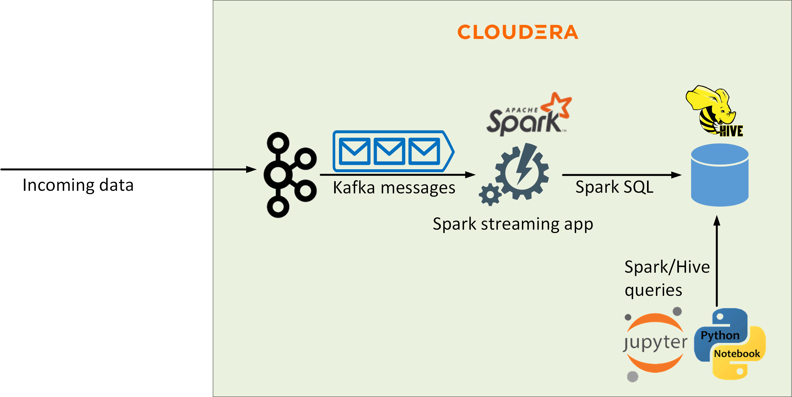
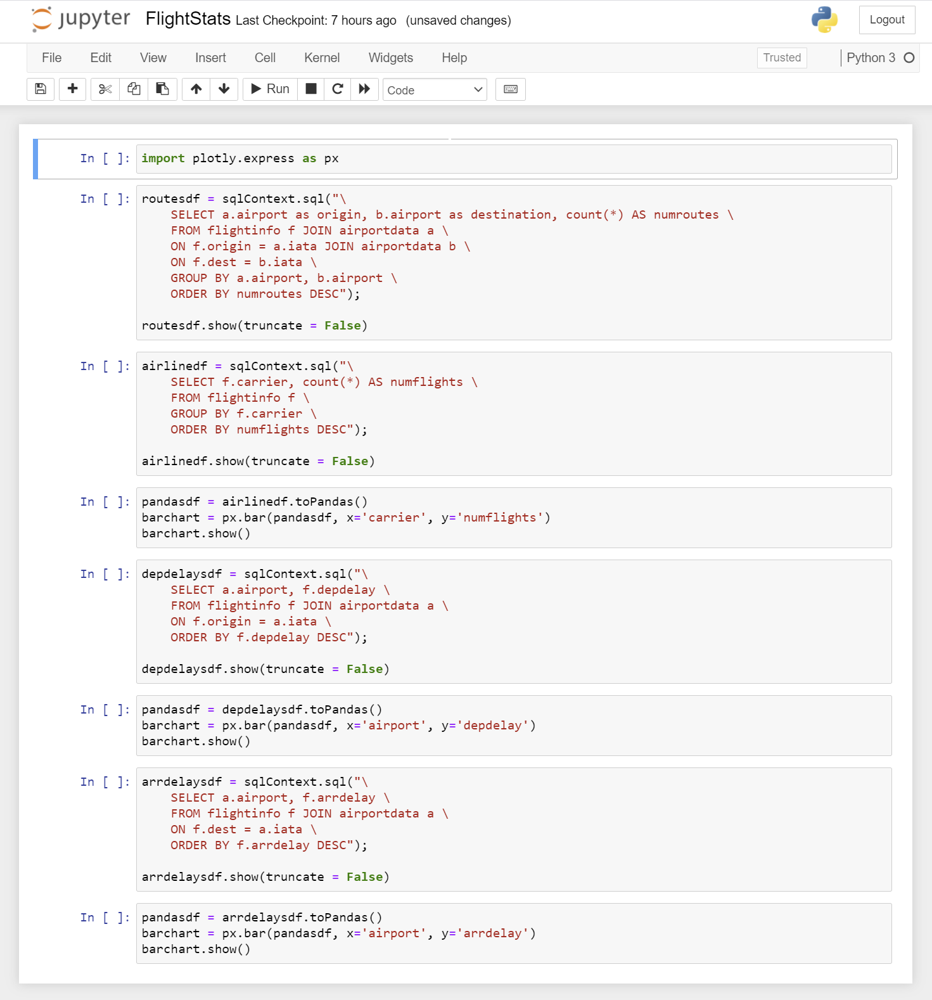
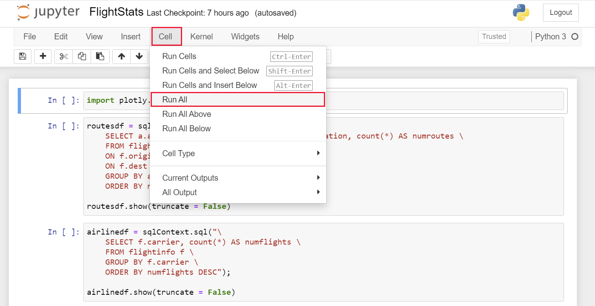
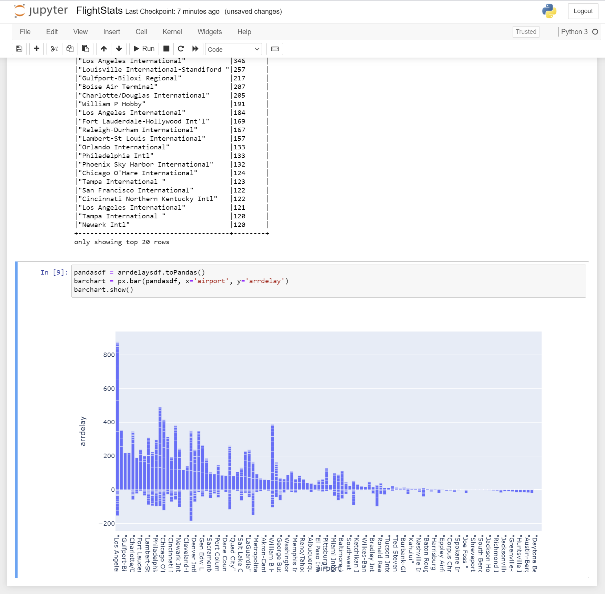
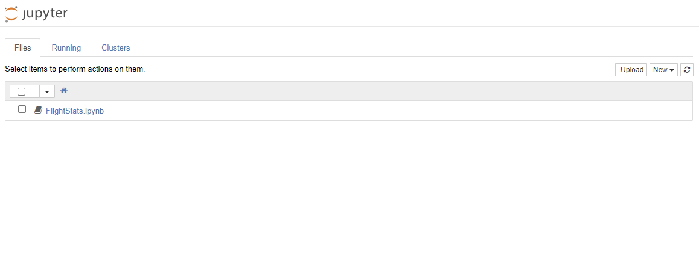
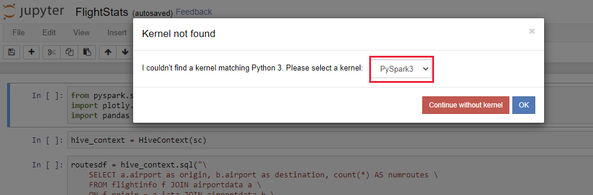

# Exercise 3: Migrate a Spark workload to HDInisght

## Introduction

In this exercise, you'll migrate a Spark workload from Cloudera to HDInsight. You'll perform the following tasks:

- Examine the existing Spark workload running on Cloudera. The workload runs inside a Jupyter notebook.
- Create an HDInsight Spark cluster.
- Migrate the notebook and data for the Spark workload to the HDInsight cluster.
- Optimize the code in the notebook for HDInsight.
- Test the Spark workload on the HDInsight cluster.

At the end of this process, the Spark applications will run on the HDInsight cluster, and retrieve data from the HDInsight cluster you created in the previous exercise.

## Task 1: Run the existing Spark workload

The existing Spark workload comprises a Jupyter notebook that generates reports based on the flight information stored in the Hive database. Specifically, it creates the following reports:

- Origin airport, destination airport, and number of flights for this route ordered by the number of flights servicing this route
- Airline, and number of flights
- Origin airport and and departure delay in descending order of departure delay
- Destination airport and arrival delay in descending order of arrival delay

The data in the Hive database comprises selected fields from the data received from Kafka. The Kafka data stream includes the IATA codes for each airport, but not the names. Instead, airport names and other static information are stored in a separate CSV file that is accessed as an external table in Hive. 


 
### Create the airportdata external table in Hive

1. If you haven't already done so, on your desktop, open a **Command Prompt** window and sign in to the Cloudera virtual machine. The username is **azureuser***. Replace *\<ip_address`>* with the IP address of the virtual machine.

    ```PowerShell
    ssh azureuser@<ip address>
    ```

1. Move to the **apps/reports** folder: 

    ```bash
    cd ~/apps/reports
    ```

1. Using an editor of your choice, open the file **airports.csv**. This file contains the static information about airports. The important fields for this exercise are **iata**, which contains the airport code, and **airport**, which holds the name of the airport.

    Close the editor when you have finished browsing the data.

1. Run the following commands to create a folder named **airportdata** in HDFS, and upload the **airports.csv** file to this folder:

    ```bash
    hdfs dfs -mkdir airportdata
    hdfs dfs -copyFromLocal airports.csv airportdata
    ```

1. Verify that the file has been uploaded correctly:

    ```bash
    hdfs dfs -ls airportdata
    ```

    The command should respond with a message similar to that shown below:

    ```text
    Found 1 items
    -rw-r--r--   3 azureuser azureuser     247809 2020-11-16 17:43 airportdata/airports.csv
    ```

1. Start the **hive** utility:

    ```bash
    hive
    ```

1. Create an external table named **airportdata** that references the CSV file in the  **airportdata** folder:

    ```sql
    CREATE EXTERNAL TABLE IF NOT EXISTS airportdata(
        iata STRING, 
        airport STRING, 
        city STRING,  
        state STRING,  
        country STRING, 
        lat DECIMAL(11,8),
        long DECIMAL(11,8)
    )
    COMMENT 'Airport names and locations'
    ROW FORMAT DELIMITED
    FIELDS TERMINATED BY ','
    STORED AS TEXTFILE
    LOCATION '/user/azureuser/airportdata'
    TBLPROPERTIES('skip.header.line.count'='1');
    ```

    ---

    **NOTE:**

    The first line in the CSV file contains the column names. This line is skipped when the table is created.

    ---

1. Query the number of rows in the table to verify that it has been created successfully:

    ```sql
    SELECT COUNT(*)
    FROM airportdata;
    ```

    The table should contain 3377 rows

1. Quit the **hive** utility:

    ```sql
    exit;
    ```
### Run the **FlightStats** Jupyter notebook

1. Run the following command to start the Jupyter notebook server:

    ```bash
    pyspark2 --driver-cores 2 --executor-memory 512m
    ```

    ---

    **NOTE:** This command starts the Jupyter service running, and also displays a simple character mode interface which you can ignore for the time being.

    ---

1. Using the web browser, move to the URL <ip-address>:8888, where *\<ip-address\>* is the IP address of the Cloudera virtual machine. You should see the Jupyter Notebooks login page:

    

1. Enter the password **Pa55w.rdDemo**, and then select **Log in**. 

    The **Files** page will appear, listing the **FlightStats** notebook and the **airports.csv** file:

    


1. Select the **FlightStats.ipynb** notebook.

    The notebook should open in a new browser window. The cells in the workbook contain Python code that uses Spark to query the data in the Hive database and generate the various reports described earlier.

    


1. In the **Cell** menu, select **Run All**:

    


1. Wait while the notebook runs. It should generate the various reports, and display the results using barcharts.

    

1. Close the browser window displaying the notebook.

1. Return to the SSH session running on the Cloudera virtual machine.

1. Press **q** to stop the Jupyter notebook server, and then press **y** to confirm that you want to halt te server.

1. When prompted, press **Ctrl-C** to shut down the kernels run by the server, and then press **y** to confirm.
## Task 2: Create the HDInsight Spark cluster

In this task, you'll create an HDInsight Spark2 cluster. You'll reuse the the storage, network, and custom Hive metadata database you created in the previous lab.


---

**NOTE:**

In the live system, the HDInsight Spark cluster will retrieve the data from the Hive database using the resources of the HDInsight LLAP cluster. To conserve resources and reduce costs, you'll use the Hive engine provided with the Spark cluster. However, you'll reuse the storage and metadata database previously created for the LLAP cluster in the previous exercise, so the **flightinfo** table should still be available.

---

### Create the Spark cluster

1. On the Azure Home page, select **Create a resource**.

1. On the **New** page, in the **Search the Marketplace** box, type **Azure HDInsight**, and then select **Azure HDInsight** from the list that appears.

1. On the **Azure HDInsight** page, select **Create**.

1. On the **Basics** tab of the **Create HDInsight cluster** page, enter the following settings, and then select **Next: Storage**:

    | Field | Value|
    |-|-|
    | Subscription | Select your subscription |
    | Resource group | clusterrg |
    | Cluster name | sparkcluster*nnnn*, where *nnnn* is the same random four digit number you used for the SQL Database (if necessary, you can use a different number, but for consistency try and reuse the same value if possible) |
    | Region | Select the same region used by the Cloudera virtual machine and the **clusterrg** resource group |
    | Cluster type | Spark |
    | Version | Spark 2.4 (HDI 4.0) |
    | Cluster login name | admin |
    | Cluster login password | Pa55w.rdDemo |
    | Confirm cluster login password | Pa55w.rdDemo |
    | Secure Shell (SSH) username | sshuser |
    | Use cluster login password for SSH | checked |

1. On the **Storage** tab, enter the following settings, and then select **Next: Security + networking**:

    | Field | Value|
    |-|-|
    | Primary storage type | Azure Data Lake Storage Gen2 |
    | Primary storage account | Select the storage account you previously created for the Kafka and Hive clusters (**clusterstorage*9999***)|
    | Filesystem | Reuse the same container that you created for the Kafka and Hive clusters (**cluster*9999***) |
    | Identity | clustermanagedid |
    | SQL database for Ambari | leave blank |
    | SQL database for Hive | hiveserver*9999*/hivedb*9999* |
    | Authenticate SQL Database | Select **Authenticate**. On the **Authenticate** page, enter **azuresa** for the username, provide the password you created for this user in the database, and then click **Test Connection**. Click **Select** to finish.
    | SQL database for Ooozie | leave blank |

1. On the **Security + networking** tab, enter the following settings, and then select **Next: Configuration + pricing**

    | Field | Value|
    |-|-|
    | Enable enterprise security package | Leave unchecked |
    | Minimum TLS version | 1.2 |
    | Virtual network | clustervnet/clusterrg |
    
    Leave all remaining settings on this tab with their default values.

1. On the **Configuration + pricing** tab, reduce the number of **Worker nodes** to 3 (to save costs for this exercise). Select **Review + create**.

1. On the validation page, select **Create**, and wait while the cluster is created.

    ---

    **NOTE:** 
    
    This operation may take 15 or 20 minutes to complete

    ---

### Configure the cluster network connectivity

1. On the Home page in the Azure portal, under **Recent resources**, select **sparkcluster*9999***.

1. On the **Overview** page for the cluster, under **Dashboards**, select **Ambari home**.

1. Sign in to Ambari as **admin** with password **Pa55w.rdDemo** when prompted. The Ambari page should show that the cluster is running the HDFS, Hive, Spark2, and Jupyter services:

    

1. In the left-hand pane of the Ambari page, select **Hosts**. Make a note of the name prefixes and IP addresses of the worker nodes with the prefixes **wn0**, **wn1**, and **wn2**. Also, record the IP address of the first head node, with the prefix **hn0**.

1. Return to the **Command Prompt** window displaying the SSH connection to the Cloudera virtual machine.

1. On the Cloudera virtual machine. run the following command to create a bash shell running as root.

    ```bash
    sudo bash
    ```

1. Edit the **/etc/hosts** file, and add entries for the head node and each of the worker nodes in the HDInsight Kafka cluster to the end of the file. The file below shows an example, based on the screenshot shown above:

    ```text
    127.0.0.1 localhost

    # The following lines are desirable for IPv6 capable hosts
    ::1 ip6-localhost ip6-loopback
    fe00::0 ip6-localnet
    ff00::0 ip6-mcastprefix
    ff02::1 ip6-allnodes
    ff02::2 ip6-allrouters
    ff02::3 ip6-allhosts

    10.10.0.4 onprem.internal.cloudapp.net onprem

    # Head node
    10.1.0.21 hn0-sparkc

    # Entries for worker nodes
    10.1.0.7 wn0-sparkc
    10.1.0.8 wn1-sparkc
    10.1.0.9 wn2-sparkc
    ```

1. Run the **ifconfig** command, and make a note of the **inet addr** field for the **eth0** device. In the example shown below, the **inet addr** is 10.10.0.4.

    ```text
    root@onprem:~/apps/kafka# ifconfig
    eth0    Link encap:Ethernet  HWaddr 00:0d:3a:98:f9:70
            inet addr:10.10.0.4  Bcast:10.10.0.255  Mask:255.255.255.0
            inet6 addr: fe80::20d:3aff:fe98:f970/64 Scope:Link
            UP BROADCAST RUNNING MULTICAST  MTU:1500  Metric:1
            RX packets:45434 errors:0 dropped:15 overruns:0 frame:0
            TX packets:51027 errors:0 dropped:0 overruns:0 carrier:0
            collisions:0 txqueuelen:1000
            RX bytes:21979594 (21.9 MB)  TX bytes:11414674 (11.4 MB)

    lo      Link encap:Local Loopback
            inet addr:127.0.0.1  Mask:255.0.0.0
            ...
    ```

1. Run the following command to quit the root shell and return to the azureuser shell.

    ```bash
    exit
    ```

1. In the Azure portal, on the page for **llapcluster*9999***, under **Settings**, select **SSH + Cluster login**. In the **SSH + Cluster login** pane, in the **Hostname** list select your cluster, and then make a note of the **ssh** command you can use to connect to this cluster:

1. On the desktop, open another command prompt window, and run the SSH command you just noted, to sign in to the head node of the Kafka cluster. The password is **Pa55w.rdDemo**:

    ```bash
    ssh sshuser@llapcluster9999-ssh.azurehdinsight.net
    ```

1. Start a shell running as root:

    ```bash
    sudo bash
    ```
1. Edit the file **/etc/hosts**, and add an entry for the Cloudera virtual machine. You noted the IP address of the Cloudera virtual machine earlier. The virtual machine has the name **onprem**, with the FQDN of **onprem.internal.cloudapp.net**. The file below shows an example, using the IP address 10.10.0.4:

    ```text
    127.0.0.1 localhost

    # The following lines are desirable for IPv6 capable hosts
    ::1 ip6-localhost ip6-loopback
    fe00::0 ip6-localnet
    ff00::0 ip6-mcastprefix
    ff02::1 ip6-allnodes
    ff02::2 ip6-allrouters
    ff02::3 ip6-allhosts
    10.3.0.16 hn0-llapcl.kaetua2hhycevkq3hkawfmrwjh.bx.internal.cloudapp.net hn0-llapcl hn0-llapcl.kaetua2hhycevkq3hkawfmrwjh.bx.internal.cloudapp.net.
    ...
    # Cloudera virtual machine
    10.10.0.4 onprem.internal.cloudapp.net onprem
    ```

1. Run the following command to quit the root shell and return to the sshuser shell.

    ```bash
    exit
    ```

1. Connect to the first worker node. The password is **Pa55w.rdDemo**, as before (the example below uses **wn0-sparkc**, although the name of the first node in your cluster may be different):

    ```bash
    ssh wn0-sparkc
    ```

1. Start a shell running as root, edit the **/etc/hosts** file, add the entry for the **onprem** virtual machine as before, and then exit the root shell.

1. Disconnect from the **wn0-sparkc** node, and return to the head node of the cluster.

1. Repeat the previous three steps for the two remaining worker nodes, such as **wn1-sparkc** and **wn2-sparkc**.

## Task 3: Migrate the data and Jupyter notebook for the Spark workload

In this task, you'll transfer the data and recreate the **airportdata** external table on the HDInsight Spark cluster. Then you'll migrate the Jupyter workbook that generates the reports. The **flightinfo** table should already be available in cluster storage. 

### Migrate the data for the **airportdata** external table

1. Return to the SSH session on the Cloudera virtual machine.

1. Execute the command shown below. This command creates a new directory called **airportdata** in cluster storage for the HDInsight cluster. Replace **\<key\>** with the key for the storage account used by the HDInsight cluster (you recorded this information in the previous exercise), and replace **\<9999\>** with the numeric suffix for your storage account:

    ```bash
    hdfs dfs \
        -D fs.azure.account.key.clusterstorage<9999>.blob.core.windows.net='<key>' \
        -mkdir wasbs://cluster<9999>@clusterstorage<9999>.blob.core.windows.net/airportdata
    ```


1. Run the following **DistCp** command to copy the for the **airportdata** table to the **airportdata** directory in the HDInsight cluster:

    ```bash
    hadoop distcp \
        -D fs.azure.account.key.clusterstorage<9999>.blob.core.windows.net='<key>' \
        /user/azureuser/airportdata/airports.csv \
        wasbs://cluster<9999>@clusterstorage<9999>.blob.core.windows.net/airportdata
    ```

1. Verify that the file has been transferred correctly:

    ```bash
    hdfs dfs \
        -D fs.azure.account.key.clusterstorage<9999>.blob.core.windows.net='<key>' \
        -ls wasbs://cluster<9999>@clusterstorage<9999>.blob.core.windows.net/airportdata
    ```

    The command should respond with a message similar to that shown below:

    ```text
    Found 1 items
    -rw-r--r--   1 azureuser supergroup     247809 2020-11-17 16:44 wasbs://cluster9999@clusterstorage9999.blob.core.windows.net/airportdata/airports.csv
    ```

1. Switch to the SSH session running on the head node of the HDInsight Spark cluster.

1. Start the **beeline** utility:

    ```bash
    sudo -u hive beeline -u 'jdbc:hive2://localhost:10001/;transportMode=http'
    ```

1. Create the **airportdata** external table that references the CSV file in the  **/airportdata** folder:

    ```sql
    CREATE EXTERNAL TABLE IF NOT EXISTS airportdata(
        iata STRING, 
        airport STRING, 
        city STRING,  
        state STRING,  
        country STRING, 
        lat DECIMAL(11,8),
        long DECIMAL(11,8)
    )
    COMMENT 'Airport names and locations'
    ROW FORMAT DELIMITED
    FIELDS TERMINATED BY ','
    STORED AS TEXTFILE
    LOCATION '/airportdata';
    ```

1. Query the number of rows in the table to verify that it has been created successfully:

    ```sql
    SELECT COUNT(*)
    FROM airportdata;
    ```

    The table should still contain 3377 rows

1. Query the number of rows in the **flightinfo** table to verify that it is still accessible:

    ```sql
    SELECT COUNT(*)
    FROM flightinfo;
    ```

1. Quit the **beeline** utility:

    ```sql
    !quit
    ```
### Transfer the FlightStats Jupyter notebook

1. Switch back to the SSH session running on the Cloudera virtual machine.

1. Move to the apps/reports folder. 

    ```bash
    cd ~/apps/reports
    ```

    This folder contains the notebook file, **FlightStats.ipynb**.

1. Copy the notebook file to the head node of the HDInsight cluster:

    ```bash
    scp FlightStats.ipynb sshuser@hn0-sparkc:~
    ```

1. Return to the SSH session running on the head node of the HDInsight Spark cluster.

1. Run the following command to upload the notebook file to the **/HdiNotebooks** folder in cluster storage. HDInsight uses this folder as the repository for  notebooks:

    ```bash
    hdfs dfs -copyFromLocal FlightStats.ipynb /HdiNotebooks
    ```

1. Using a web browser, navigate to the URL **https://sparkcluster<9999>.azurehdinsight.net/jupyter**. This is the URL for the Jupyter server running on the HDInsight Spark cluster. The **FlightStats.ipynb** notebook should be listed.

    

1. Select the **FlightStats.ipynb** notebook.

1. When the notebook opens, it will prompt you for the kernel to use. Select the **PySpark3** kernel, and then select **OK**.

    


## Task 4: Optimize the notebook for HDInsight

In this task, you'll modify te code in the workbook to take advantage of the features available with Jupyter notebooks on HDInsight.


## Task 5: Tidy up

1. In the Azure portal, go to the page for the HDInsight Spark cluster.

1. In the command bar, select **Delete**.

1. In the confirmation pane, enter the name of the cluster, and then select **Delete**.