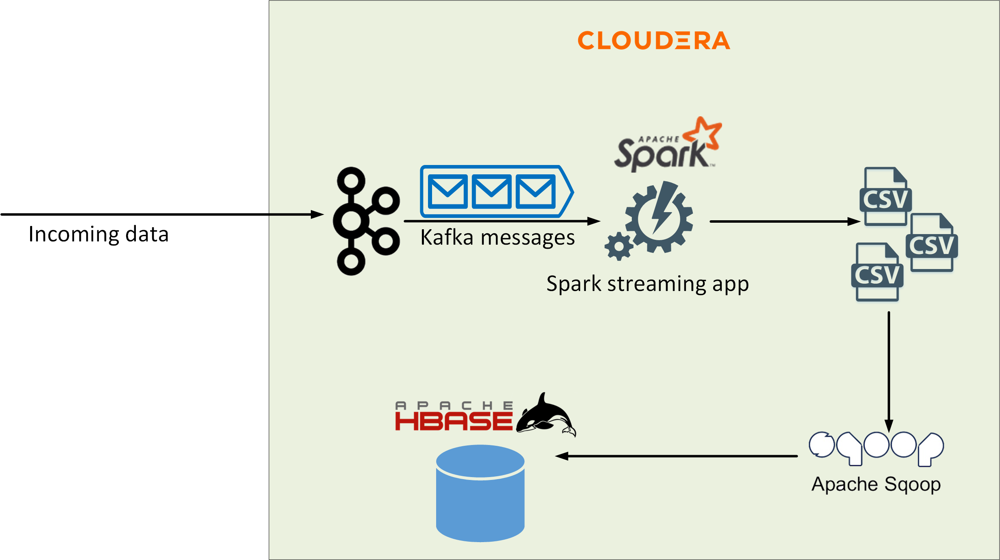
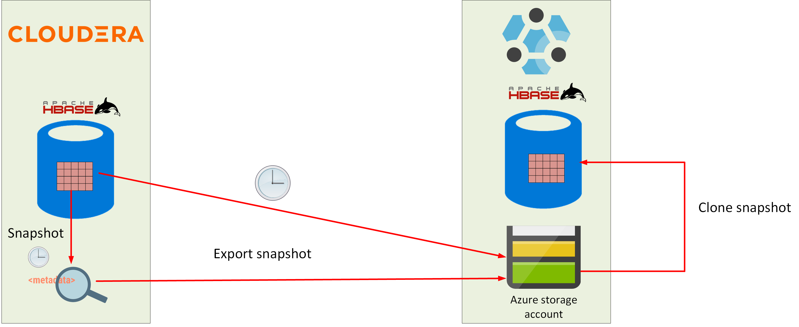
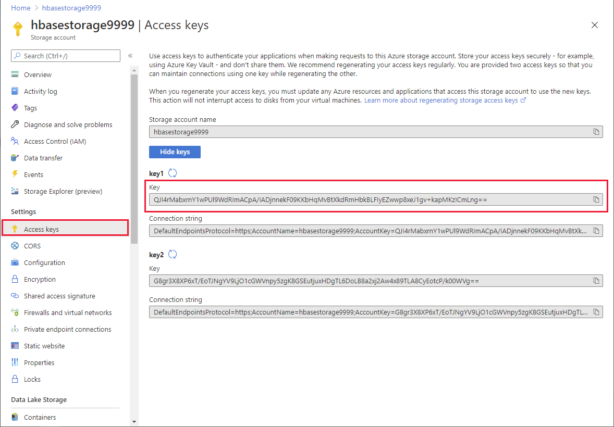

# Exercise 4: Migrate an HBase database to HDInsight

## Introduction

In this exercise, you'll migrate an an HBase database from Cloudera to HDInsight. You'll perform the following tasks:

- Examine the existing database currently running on Cloudera.
- Create the virtual infrastructure for an HDInsight HBase cluster, and then create the cluster.
- Use HBase snapshots to transfer data from the Cloudera cluster to the HDInsight cluster.
- Verify that the data has been transferred correctly.

At the end of this process, the Hive database will have been relocated to the HDInsight cluster. Applications that utilize the database for analytical purposes can be reconfigured to connect to the instance on HDInsight.

## Task 1: Examine the existing HBase database

In the existing on-premises system, a Spark application acts as a receiver for messages arriving on a Kafka topic. The Spark application posts writes the data, in batches, to a series of CSV files. A Sqoop job periodically uploads the data in these files to HBase. In this exercise, you'll replicate the Cloudera Hive database to an HDInsight cluster.

The first task is to examine the existing database.



---

**NOTE:**
In the example used by by this lab exercise, the files generated by the Spark application have already been created. You will perform HBase import operations manually to simulate Sqoop uploading the data. 

---

1. If you haven't already done so, on your desktop, open a **Command Prompt** window and sign in to the Cloudera virtual machine. The username is **azureuser***. Replace *\<ip_address`>* with the IP address of the virtual machine.

    ```PowerShell
    ssh azureuser@<ip address>
    ```

1. Move to the **apps/hbase** folder:

    ```bash
    cd ~/app/hbase
    ```

1. Start the HBase shell:

    ```bash
    hbase shell
    ```

1. Run the following command:

    ```bash
    create 'flights', 'info', 'departures', 'arrivals', 'delays'
    ```

    This command creates a new table named **flights**, with four column families; **info**, **departures**, **arrivals**, and **delays**.

1. Run the command shown below to verify that the **flights** table has been created successfully:

    ```hbase
    describe 'flights'
    ```

    The output should look like this:

    ```text
    => Hbase::Table - flights
    hbase(main):014:0> describe 'flights'
    Table flights is ENABLED
    flights
    COLUMN FAMILIES DESCRIPTION
    {NAME => 'arrivals', BLOOMFILTER => 'ROW', VERSIONS => '1', IN_MEMORY => 'false', KEEP_DELETED_CELLS => 'FALSE', DATA_BLOCK_ENCODING => 'NONE', TTL => 'FOREVER', COMPRESSION => 'NONE', MIN_VERSIONS => '0', BLOCKCACHE => 'true', BLOCKSIZE => '65536', REPLICATION_SCOPE => '0'}
    {NAME => 'delays', BLOOMFILTER => 'ROW', VERSIONS => '1', IN_MEMORY => 'false', KEEP_DELETED_CELLS => 'FALSE', DATA_BLOCK_ENCODING => 'NONE', TTL => 'FOREVER', COMPRESSION => 'NONE', MIN_VERSIONS => '0', BLOCKCACHE => 'true', BLOCKSIZE => '65536', REPLICATION_SCOPE => '0'}
    {NAME => 'departures', BLOOMFILTER => 'ROW', VERSIONS => '1', IN_MEMORY => 'false', KEEP_DELETED_CELLS => 'FALSE', DATA_BLOCK_ENCODING => 'NONE', TTL => 'FOREVER', COMPRESSION => 'NONE', MIN_VERSIONS => '0', BLOCKCACHE => 'true', BLOCKSIZE => '65536', REPLICATION_SCOPE => '0'}
    {NAME => 'info', BLOOMFILTER => 'ROW', VERSIONS => '1', IN_MEMORY => 'false', KEEP_DELETED_CELLS => 'FALSE', DATA_BLOCK_ENCODING => 'NONE', TTL => 'FOREVER', COMPRESSION => 'NONE', MIN_VERSIONS => '0', BLOCKCACHE => 'true', BLOCKSIZE => '65536', REPLICATION_SCOPE => '0'}
    4 row(s) in 0.0170 seconds
    ```

1. Quit the hbase shell:

    ```hbase
    exit
    ```

1. At the bash prompt, run the command shown below. This command shows the data in the first batch created by the Spark process. The file contains 9999 records:


    ```bash
    more batch1.csv
    ```
    
    Browse the data, and then press **q** to quit when you are finished.

1. Upload the **batch1.csv** file to HDFS

    ```bash
    hdfs dfs -copyFromLocal batch1.csv
    ```
    
1. Run the following command. This command simulates Sqoop uploading the data in the copy of the **batch1.csv** file in HDFS to the HBase database. It runs a MapReduce task:

    ```bash
    hbase org.apache.hadoop.hbase.mapreduce.ImportTsv \
    -Dimporttsv.separator=',' \
    -Dimporttsv.columns=HBASE_ROW_KEY, \
    info:UniqueCarrier, \
    info:FlightNum, \
    info:TailNum, \
    info:Distance, \
    info:Origin, \
    info:Dest, \
    departures:Year, \
    departures:Month, \
    departures:DayofMonth, \
    departures:DayOfWeek, \
    departures:DepTime, \
    departures:CRSDepTime, \
    arrivals:ArrTime, \
    arrivals:CRSArrTime, \
    arrivals:ActualElapsedTime, \
    arrivals:CRSElapsedTime, \
    arrivals:AirTime, \
    delays:ArrDelay, \
    delays:DepDelay, \
    delays:TaxiIn, \
    delays:TaxiOut, \
    delays:Cancelled, \
    delays:CancellationCode, \
    delays:Diverted, \
    delays:CarrierDelay, \
    delays:WeatherDelay, \
    delays:NASDelay, \
    delays:SecurityDelay, \
    delays:LateAircraftDelay \
    flights \
    batch1.csv
    ```

1. Start the hbase shell again:

    ```bash
    hbase
    ```

1. Run the command shown below:

    ```hbase
    get 'flights', 1
    ```

    This command retrieves the data for the first record from the **flights** table. It should look like this.

    ```text
    COLUMN                                    CELL
    arrivals:ActualElapsedTime               timestamp=1605097033332, value=255
    arrivals:AirTime                         timestamp=1605097033332, value=244
    arrivals:ArrTime                         timestamp=1605097033332, value=1057
    arrivals:CRSArrTime                      timestamp=1605097033332, value=1101
    arrivals:CRSElapsedTime                  timestamp=1605097033332, value=255
    delays:ArrDelay                          timestamp=1605097033332, value=-4
    delays:CancellationCode                  timestamp=1605097033332, value=NA
    delays:Cancelled                         timestamp=1605097033332, value=0
    delays:CarrierDelay                      timestamp=1605097033332, value=NA
    delays:DepDelay                          timestamp=1605097033332, value=-4
    delays:Diverted                          timestamp=1605097033332, value=0
    delays:LateAircraftDelay                 timestamp=1605097033332, value=NA
    delays:NASDelay                          timestamp=1605097033332, value=NA
    delays:SecurityDelay                     timestamp=1605097033332, value=NA
    delays:TaxiIn                            timestamp=1605097033332, value=3
    delays:TaxiOut                           timestamp=1605097033332, value=8
    delays:WeatherDelay                      timestamp=1605097033332, value=NA
    departures:CRSDepTime                    timestamp=1605097033332, value=846
    departures:DayOfWeek                     timestamp=1605097033332, value=6
    departures:DayofMonth                    timestamp=1605097033332, value=1
    departures:DepTime                       timestamp=1605097033332, value=842
    departures:Month                         timestamp=1605097033332, value=1
    departures:Year                          timestamp=1605097033332, value=2000
    info:Dest                                timestamp=1605097033332, value=PHX
    info:Distance                            timestamp=1605097033332, value=1587
    info:FlightNum                           timestamp=1605097033332, value=609
    info:Origin                              timestamp=1605097033332, value=ATL
    info:TailNum                             timestamp=1605097033332, value=N158AW
    info:UniqueCarrier                       timestamp=1605097033332, value=HP
    ```

1. Run this command:

    ```hbase
    count 'flights'
    ```

    This command shows the cumulative number of rows in each data block allocated to the table and its column families, together with a grand total. The grand total should be 9999:

    ```text
    Current count: 1000, row: 1899
    Current count: 2000, row: 2799
    Current count: 3000, row: 3699
    Current count: 4000, row: 4599
    Current count: 5000, row: 5499
    Current count: 6000, row: 6399
    Current count: 7000, row: 7299
    Current count: 8000, row: 8199
    Current count: 9000, row: 9099
    9999 row(s) in 0.9870 seconds

    => 9999
    ```

1. Leave the hbase shell:

    ```hbase
    exit
    ```

## Task 2: Create the HDInsight HBase cluster

In this task, you'll create an HDInsight HBase cluster. You'll reuse the existing network from the previous exercises, but you'll create a new Blob storage account for the cluster. This is because Blob storage provides better performance for HBase than Data Lake storage.

### Create the storage account

1. Return to the Azure portal in the web browser.

1. If the Home page isn't currently displayed, click select the **Home** link in the upper left hand corner:

1. On the Azure Home page, select **Create a resource**.

1. On the **New** page, in the **Search the Marketplace** box, type **storage account network**, and then select **Storage account** from the list that appears.

1. On the **Storage account** page, select **Create**.

1. On the **Basics** tab of the **Create storage account** page, enter the following settings, and then select **Review + create**:

    | Field | Value|
    |-|-|
    | Subscription | Select your subscription |
    | Resource group | clusterrg |
    | Storage account name | hbasestorage*nnnn*, where *nnnn* is a random four digit number you select to avoid clashing with other storage accounts |
    | Location | Select the same region used by the Cloudera virtual machine and the **clusterrg** resource group |
    | Performance | Premium |
    | Account Kind | BlockBlobStorage |
    | Replication | Locally-redundant storage (LRS) |

1. On the validation page, select **Create**, and wait while the storage account is created.

1. On the Home page in the Azure portal, under **Recent resources**, select **hbasestorage*9999***.

1. On the **hbasestorage*9999*** page select **Access Control (IAM)**:

1. On the **hbasestorage*9999* | Access Control (IAM)** page select **Add**, and then select **Add role assignment**:

1. In the **Add role assignment** pane, enter the following settings, and then select **Save**:

    | Field | Value|
    |-|-|
    | Role | Storage Blob Data Ower |
    | Assign access to | User assigned managed identity |
    | Subscription | Select your subscription |
    | Select | clustermanagedid |

1. Wait while the role is assigned, and then click **Role assignments** to verify that it has been assigned successfully:

### Create the HBase cluster

1. On the Azure Home page, select **Create a resource**.

1. On the **New** page, in the **Search the Marketplace** box, type **Azure HDInsight**, and then select **Azure HDInsight** from the list that appears.

1. On the **Azure HDInsight** page, select **Create**.

1. On the **Basics** tab of the **Create HDInsight cluster** page, enter the following settings, and then select **Next: Storage**:

    | Field | Value|
    |-|-|
    | Subscription | Select your subscription |
    | Resource group | clusterrg |
    | Cluster name | hbasecluster*nnnn*, where *nnnn* is the same random four digit number you selected when you created the storage account (if necessary, you can use a different number, but for consistency try and reuse the same value if possible) |
    | Region | Select the same region used by the Cloudera virtual machine and the **clusterrg** resource group |
    | Cluster type | HBase |
    | Version | HBase 2.1.6 (HDI 4.0) |
    | Enable HBAse accelerated writes | checked |
    | Cluster login name | admin |
    | Cluster login password | Pa55w.rdDemo |
    | Confirm cluster login password | Pa55w.rdDemo |
    | Secure Shell (SSH) username | sshuser |
    | Use cluster login password for SSH | checked |

1. On the **Storage** tab, enter the following settings, and then select **Next: Security + networking**:

    | Field | Value|
    |-|-|
    | Primary storage type | Azure Data Lake Storage Gen2 |
    | Primary storage account | hbasestorage*9999* |
    | Filesystem | cluster*9999* |
    | User-assigned managed identity | clustermanagedid |
    | SQL database for Ambari | leave blank |
    | SQL database for Hive | leave blank |
    | SQL database for Ooozie | leave blank |

1. On the **Security + networking** tab, enter the following settings, and then select **Next: Configuration + pricing**

    | Field | Value|
    |-|-|
    | Enable enterprise security package | Leave unchecked |
    | Minimum TLS version | 1.2 |
    | Virtual network | clustervnet/clusterrg |
    
    Leave all remaining settings on this tab with their default values.

1. On the **Configuration + pricing** tab, reduce the number of **Region nodes** to 3 (to save costs for this exercise), set the **Node size** to **DS12 v2**, and then select **Review + create**.

1. On the validation page, select **Create**, and wait while the cluster is created.

    ---

    **NOTE:** 
    
    This operation may take 15 or 20 minutes to complete

    ---

### Configure the cluster network connectivity

1. On the Home page in the Azure portal, under **Recent resources**, select **hbasecluster*9999***.

1. On the **Overview** page for the cluster, under **Dashboards**, select **Ambari home**.

1. Sign in to Ambari as **admin** with password **Pa55w.rdDemo** when prompted.

1. In the left-hand pane of the Ambari page, select **Hosts**. Make a note of the name prefixes and IP addresses of the worker nodes with the prefixes **wn0**, **wn1**, and **wn2**.

1. Return to the **Command Prompt** window displaying the SSH connection to the Cloudera virtual machine.

1. On the Cloudera virtual machine. run the following command to create a bash shell running as root.

    ```bash
    sudo bash
    ```

1. Edit the **/etc/hosts** file, and add entries for each of the worker nodes in the HDInsight Kafka cluster to the end of the file. The file below shows an example, based on the screenshot shown above:

    ```text
    127.0.0.1 localhost

    # The following lines are desirable for IPv6 capable hosts
    ::1 ip6-localhost ip6-loopback
    fe00::0 ip6-localnet
    ff00::0 ip6-mcastprefix
    ff02::1 ip6-allnodes
    ff02::2 ip6-allrouters
    ff02::3 ip6-allhosts

    # Entries for worker nodes
    10.3.0.5 wn0-hbasec
    10.3.0.7 wn1-hbasec
    10.3.0.6 wn2-hbasec
    ```

1. Run the **ifconfig** command, and make a note of the **inet addr** field for the **eth0** device. In the example shown below, the **inet addr** is 10.10.0.4.

    ```text
    root@onprem:~/apps/kafka# ifconfig
    eth0    Link encap:Ethernet  HWaddr 00:0d:3a:98:f9:70
            inet addr:10.10.0.4  Bcast:10.10.0.255  Mask:255.255.255.0
            inet6 addr: fe80::20d:3aff:fe98:f970/64 Scope:Link
            UP BROADCAST RUNNING MULTICAST  MTU:1500  Metric:1
            RX packets:45434 errors:0 dropped:15 overruns:0 frame:0
            TX packets:51027 errors:0 dropped:0 overruns:0 carrier:0
            collisions:0 txqueuelen:1000
            RX bytes:21979594 (21.9 MB)  TX bytes:11414674 (11.4 MB)

    lo      Link encap:Local Loopback
            inet addr:127.0.0.1  Mask:255.0.0.0
            ...
    ```

1. Run the following command to quit the root shell and return to the azureuser shell.

    ```bash
    exit
    ```

1. In the Azure portal, on the page for **hbasecluster*9999***, under **Settings**, select **SSH + Cluster login**. In the **SSH + Cluster login** pane, in the **Hostname** list select your cluster, and then make a note of the **ssh** command you can use to connect to this cluster:

1. On the desktop, open another command prompt window, and run the SSH command you just noted, to sign in to the head node of the Kafka cluster. The password is **Pa55w.rdDemo**:

    ```bash
    ssh sshuser@hbasecluster9999-ssh.azurehdinsight.net
    ```

1. Start a shell running as root:

    ```bash
    sudo bash
    ```
1. Edit the file **/etc/hosts**, and add an entry for the Cloudera virtual machine. You noted the IP address of the Cloudera virtual machine earlier. The virtual machine has the name **onprem**, with the FQDN of **onprem.internal.cloudapp.net**. The file below shows an example, using the IP address 10.10.0.4:

    ```text
    127.0.0.1 localhost

    # The following lines are desirable for IPv6 capable hosts
    ::1 ip6-localhost ip6-loopback
    fe00::0 ip6-localnet
    ff00::0 ip6-mcastprefix
    ff02::1 ip6-allnodes
    ff02::2 ip6-allrouters
    ff02::3 ip6-allhosts
    10.3.0.16 hn0-llapcl.kaetua2hhycevkq3hkawfmrwjh.bx.internal.cloudapp.net hn0-llapcl hn0-llapcl.kaetua2hhycevkq3hkawfmrwjh.bx.internal.cloudapp.net.
    ...
    # Cloudera virtual machine
    10.10.0.4 onprem.internal.cloudapp.net onprem
    ```

1. Run the following command to quit the root shell and return to the sshuser shell.

    ```bash
    exit
    ```

1. Connect to the first worker node. The password is **Pa55w.rdDemo**, as before (the example below uses **wn0-hbasec**, although the name of the first node in your cluster may be different):

    ```bash
    ssh wn0-hbasec
    ```

1. Start a shell running as root, edit the **/etc/hosts** file, add the entry for the **onprem** virtual machine as before, and then exit the root shell.

1. Disconnect from the **wn0-hbasec** node, and return to the head node of the cluster.

1. Repeat the previous three steps for the two remaining worker nodes, **wn1-hbasec** and **wn2-hbasec**.

    ---

    **NOTE:**
    Under some circumstances, the worker nodes might not be named sequentially. For example, you might that they are named **wn3-hbasec** and **wn4-hbasec**, as illustrated in the examples shown above. Check the entries in the **/etc/hosts** file of the head node for the names of these nodes.

    ---

## Task 3: Transfer data using HBase snapshots

In this task, you'll create a snapshot of the HBase database in the Cloudera cluster and export this snapshot to the Azure storage account holding the filesystem for the HDInsight cluster. On the HDInsight, you'll clone the snapshot to import the data into the HBase database.




### Create a snapshot

1. Switch to the SSH session running on the Cloudera virtual machine, and start the hbase shell:

    ```bash
    hbase shell
    ```

1. Create a snapshot of the **flights** table named **snaphsot1**:

    ```hbase
    snapshot 'flights', 'snapshot1'
    ```

    ---

    **NOTE:**

    This command displays the message `0 row(s)`. This is the number of rows returned by the command, and not the number of rows identified in the snapshot.

    ---

1. Verify that the snapshot has been created successfully:

    ```hbase
    list_snapshots
    ```

    This command should generate output similar to the following:

    ```text
    SNAPSHOT                              TABLE + CREATION TIME
    snapshot1                            flights (Thu Nov 12 12:23:30 +0000 2020)
    1 row(s) in 0.0060 seconds

    => ["snapshot1"]
    ```

1. Close the hbase shell:

    ```hbase
    exit
    ```

### Export the snapshot

1. Return to the Azure portal in the web browser.

1. On the Home page in the Azure portal, under **Recent resources**, select **hbasestorage*9999***.

1. Under **Settings**, select **Access keys**, and make a note of the value for the **key1** key:

    

1. Return to the SSH session on the Cloudera virtual machine.

1. Export the **snapshot1** snapshot to the **/hbase** directory on the HDInsight cluster. This is the home directory of HBase on the HDInsight cluster. As before, replace **\<9999\>** with the numeric identifier for your storage account, and replace **\<account key\>** with the value of the **key1** key for the storage account.

    ```bash
    hbase org.apache.hadoop.hbase.snapshot.ExportSnapshot \
    -D fs.azure.account.key.hbasestorage<9999>.blob.core.windows.net='<account key>' \
    -snapshot 'flights-snapshot1' \
    -copy-to 'wasbs://cluster<9999>@hbasestorage<9999>.blob.core.windows.net/hbase'
    ```

    This command runs a MapReduce job that transfers the data. Verify that it completes without error.

### Import the snapshot

1. Switch to the SSH session connected to the head node of the HDInsight HBase cluster.

1. Start the hbase shell:

    ```bash
    hbase shell
    ```
1. Verify that the snapshot has been transferred:

    ```hbase
    list_snapshots
    ```

1. Clone the snapshot. This action will create the **flights** table and import the data:

    ```hbase
    clone_snapshot 'snapshot1', 'flights'
    ```

1. Enable the flights table:

    ```hbase
    enable 'flights'
    ```

1. Show the structure of the **flights** table, and verify that it contains the **arrivals**, **delays**, **departures**, and **info** column families:

    ```hbase
    describe 'flights'
    ```

1. Display the number of rows in the **flights** table:

    ```hbase
    count 'flights'
    ```

    Verify that the table contains 9999 rows.

1. Close the hbase shell:

    ```hbase
    exit
    ```

## Task 4: Copy incremental inserts

In the example scenario, new rows are periodically added in batches to the HBase database. If you haven't fully switched to the HDInsight cluster, then you can perform an incremental export from the database on the Cloudera cluster, and import the new rows to the database on the HDInsight cluster.

---

**NOTE:**

The operations described in this task assume that the data in the HBase database is not modified once it has been uploaded by Sqoop, possibly causing the command used in this task to export the data to miss some rows.

---

### Perform an incremental export

1. Return to the SSH session on the Cloudera virtual machine and start the hbase shell.

1. Run the following command to retrieve the data for the **info** column family in the last row added to the **flights** table:

    ```hbase
    get 'flights', 9999, 'info'
    ```

    The results should look similar to this:

    ```text
    COLUMN                               CELL
    info:Dest                            timestamp=1605097033332, value=SEA
    info:Distance                        timestamp=1605097033332, value=1449
    info:FlightNum                       timestamp=1605097033332, value=196
    info:Origin                          timestamp=1605097033332, value=ANC
    info:TailNum                         timestamp=1605097033332, value=N955AS
    info:UniqueCarrier                   timestamp=1605097033332, value=AS
    6 row(s) in 0.0100 seconds
    ```

    Make a note of the timestamp. It should be the same for each cell.

1. Close the hbase shell.

1. Upload the **batch2.csv** file to HDFS. This file contains the next batch of flight data.

    ```bash
    hdfs dfs -copyFromLocal batch2.csv
    ```
    
1. Uploading the data in the copy of the **batch2.csv** file in HDFS to the HBase database:

    ```bash
    hbase org.apache.hadoop.hbase.mapreduce.ImportTsv \
    -Dimporttsv.separator=',' \
    -Dimporttsv.columns=HBASE_ROW_KEY, \
    info:UniqueCarrier, \
    info:FlightNum, \
    info:TailNum, \
    info:Distance, \
    info:Origin, \
    info:Dest, \
    departures:Year, \
    departures:Month, \
    departures:DayofMonth, \
    departures:DayOfWeek, \
    departures:DepTime, \
    departures:CRSDepTime, \
    arrivals:ArrTime, \
    arrivals:CRSArrTime, \
    arrivals:ActualElapsedTime, \
    arrivals:CRSElapsedTime, \
    arrivals:AirTime, \
    delays:ArrDelay, \
    delays:DepDelay, \
    delays:TaxiIn, \
    delays:TaxiOut, \
    delays:Cancelled, \
    delays:CancellationCode, \
    delays:Diverted, \
    delays:CarrierDelay, \
    delays:WeatherDelay, \
    delays:NASDelay, \
    delays:SecurityDelay, \
    delays:LateAircraftDelay \
    flights \
    batch2.csv
    ```

1. Start the hbase shell again:

    ```bash
    hbase
    ```

1. Run the command shown below:

    ```hbase
    count 'flights'
    ```

    This time, the table should contain 19998 rows.

1. Close the hbase shell.

1. Run the following command to perform an incremental export of the data in the **flights** table. The data is written to the **flightdata** directory in HDFS. Replace **\<timestamp + 1\>** with the value of the timestamp noted for the data in row 9999 of the table, with 1 added. For example, the earlier sample output showed a timestamp of 1605097033332, so use the value 1605097033333 in this case:

    ```bash
    hbase org.apache.hadoop.hbase.mapreduce.Export 'flights' 'flightdata' 1 <timestamp + 1>
    ```

    ---

    **NOTE:**
    This export command only exports the latest version of each row; the number of versions to export is set to **1**

    ---

### Transfer and import the data

1. Use the **DistCp** utility to copy the data to the HDInsight HBase cluster, as follows:

    ```bash
    hadoop distcp \
        -D fs.azure.account.key.hbasestorage<9999>.blob.core.windows.net='<key>' \
        /user/azureuser/flightdata \
        wasbs://cluster<9999>@hbasestorage<9999>.blob.core.windows.net/staging/flightdata
    ```

1. Switch to the SSH session on the head node of the HDInsight HBase cluster.

1. Run the following command to import the data found in the **/staging/flightdata** directory to the **flights** table:

    ```bash
    hbase org.apache.hadoop.hbase.mapreduce.Import flights /staging/flightdata
    ```

    In the output generated by this command, you should see the following messages in the summary of the operation:

    ```text
    ...
    Map-Reduce Framework
            Map input records=9999
            Map output records=9999
    ...
    ```

    These messages indicate that 9999 rows have been imported.

1. Start the hbase shell and run the following query:

    ```hbase
    count 'flights'
    ```

    Verify that the **flights** table now contains 19998 rows.

**You have now migrated the HBase database to HDInsight by using snapshots. You have also seen how to use incremental exports to keep the database on HDInsight up to date:**
    
## Task 5: Tidy up

1. In the Azure portal, go to the page for the HDInsight HBase cluster.

1. In the command bar, select **Delete**:

1. In the confirmation pane, enter the name of the cluster, and then select **Delete**.