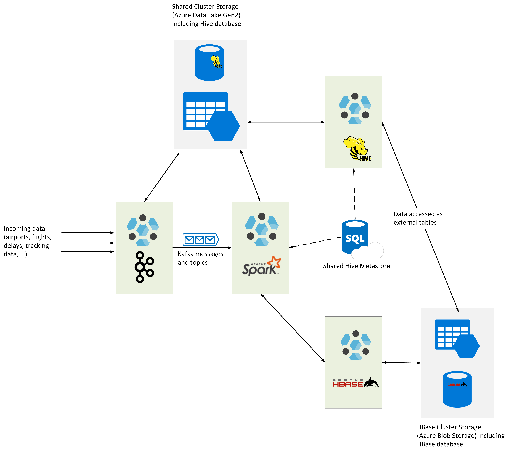

# Summary

In this lab, you have performed the following tasks:

- Migrate a Kafka workload from Cloudera to an HDInsight 4.0 Kafka cluster.
- Migrate a Hive workload and data from Cloudera to an HDInsight 4.0 LLAP cluster.
- Migrate a Spark workload from Cloudera to an HDInsight 4.0 Spark cluster.
- Migrate HBase data from Cloudera to an HDInsight 4.0 HBase cluster.

The HDInsight solution comprises four clusters (Kafka, Spark, Hive, and HBase) running on a shared network infrastructure in Azure:

