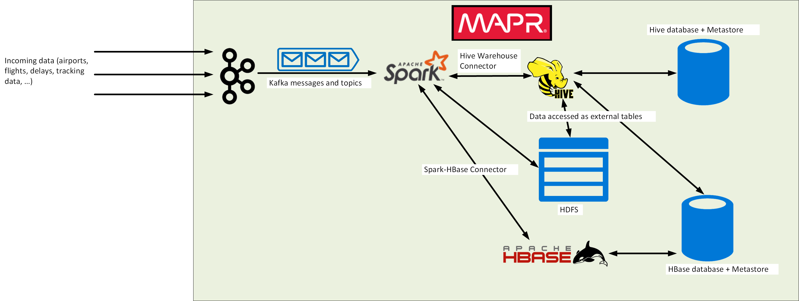
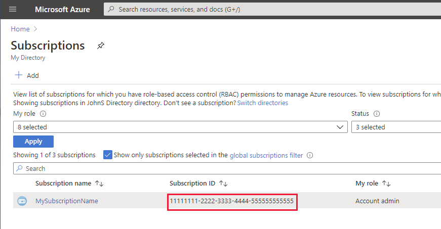
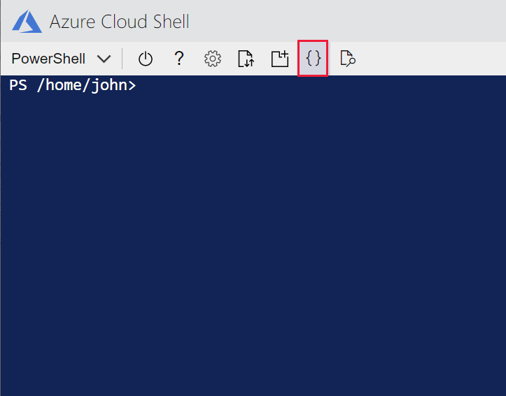
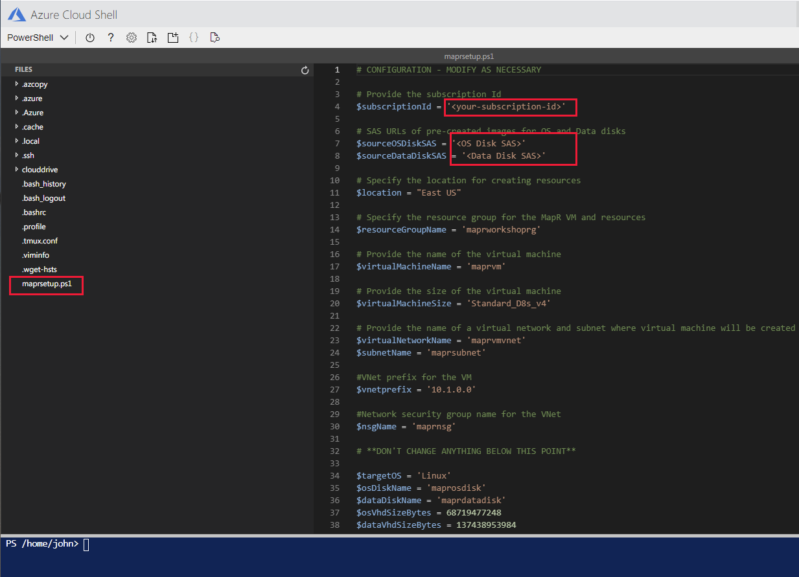
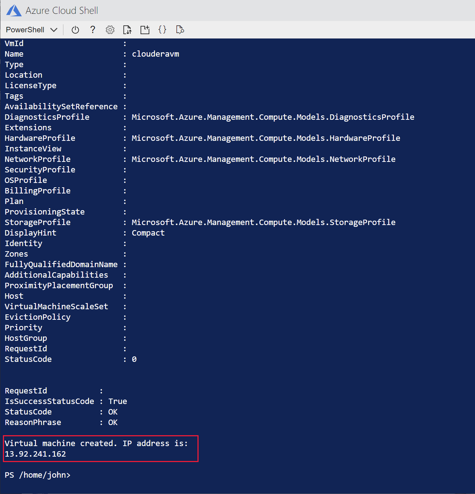

# Overview

In this workshop, you'll learn how to:

- Migrate a Kafka workload from MapR to an HDInsight 4.0 Kafka cluster.
- Migrate a Hive workload and data from MapR to an HDInsight 4.0 LLAP cluster.
- Migrate a Spark workload from MapR to an HDInsight 4.0 Spark cluster.
- Migrate HBase data from MapR to an HDInsight 4.0 HBase cluster.

This workshop follows the techniques and strategies described in the document **Migrate your Big Data Workloads to HDInsight**.

# Scenario

Imagine that you work for Contoso, an organization that performs Big Data analytics for the transport industry. The organization is currently engaged in a project that examines the data for commercial airlines, tracking which airlines fly to and from which airports, and analysing the flight times and frequency of flight delays. The data arrives from a number of sources, and includes real-time tracking information provided by the airlines and the various airports. The raw data is captured using Kafka and passed to a number of clients for processing using Spark and Hive. The processed data is stored in an HBase database for subsequent analysis. The current system is based on a MapR cluster, running  Hive, Spark, HBase, and Kafka services. The following image shows the high-level architecture of the existing system:



Contoso wish to move operations from MapR to HDInsight. However, the system cannot be shutdown while migration occurs, so the transfer must e performed in a manner that allows operations to continue during the switchover, although some temporary degradation in performance is permissible while this occurs.

You will migrate from the MapR cluster to four HDInsight clusters, utilizing shared cluster storage and metadata databases. This architecture enables you to decouple and tune each cluster for a specific workload, and allows you to scale the clusters independently. The solution architecture looks like this:


The HBase cluster utilizes its own storage account. The rationale behind this approach is that while Azure Data Lake Gen 2 storage gives the best performance for Hive, Spark, and Kafka clusters, HBase works best with Azure Blob storage.

---

**NOTE:** 

Due to time constraints, in this workshop you will not deploy the clusters using the Enterprise Security Package. In a production system, you must always ensure that your clusters run in a safe and secure environment.

---

# Setup

Before starting the workshop, set up the Contoso environment containing the apps and services that you will migrate to HDInsight. To save costs in this workshop, the Contoso environment consists of a single node cluster. This cluster runs MapR 5.16.2 and Kafka 3.1, to simulate a legacy system.

Perform the following tasks:

1. Sign in to the Azure portal using a web browser.

1. On the **Home** page, click **Subscriptions**.

    

1. Make a note of the **Subscription ID** associated with your account.

    

1. In the toolbar, click **Cloud Shell**.

    

1. In the Cloud Shell dropdown list, select **PowerShell**. Click **Confirm** if prompted.

    

1. Run the command shown below to retrieve the script that create the resources and the virtual machine that will be used to run the MapR services.

    **NOTE: BEFORE PUBLISHING THIS WORKSHOP, REPLACE THE URL BELOW WITH THE ADDRESS OF THE GITHUB REPO HOLDING THE SCRIPT**
    ```PowerShell
    wget https://raw.githubusercontent.com/JohnPWSharp/MigrationWorkshop/main/maprsetup.ps1
    ```

1. In the Cloud Shell toolbar, select **Open editor**.

    

1. In the **Files** pane of the editor, select **maprsetup.ps1** to open the setup script. In the script, replace **\<your-subscription-id\>** with your subscription id, and replace **\<OS Disk SAS\>** and **\<Data Disk SAS\>** with the SAS URLs of the MapR disks that will be used to create the virtual machine. **Your instructor should provide you with these URLs**.


    


1. Press **CTRL-S** to save the file, and then press **CTRL-Q** to leave the editor.

1. Run the script with the following command:

    ```PowerShell
    .\maprsetup.ps1
    ```

    As the script runs, you will see various messages when the resources are created. The script will take about 10 minutes to complete. When it has finished, it will display the IP address of the new virtual machine. Make a note of this address.

    

1. Connect using SSH as the **azureuser** user as shown below. Replace **\<ip address\>** with the IP address of the virtual machine. The password is **Pa55w.rdDemo**. Enter **yes** when prompted to connect.

    ---

    **NOTE:** 
    
    You may need to wait for a couple of minutes while the virtual machine services start before continuing

    ---

    ```PowerShell
    ssh azureuser@<ip address>
    ```

1. At the *bash* prompt, run the following command to change the password for the **azureuser** account. Provide a password of your own choosing.

    ```bash
    passwd
    ```

1. Run the following command to sign out from the virtual machine and return to the PowerShell prompt:

    ```bash
    exit
    ```

1. In the Azure portal, close the PowerShell pane.